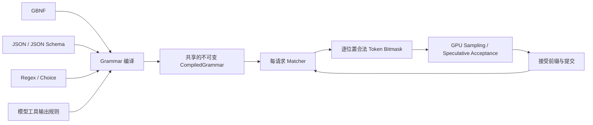
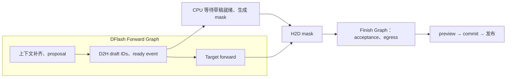

# Constrained decoding 设计

本文定义 NInfer 约束解码的架构、功能语义与执行合同。当前已实现 GBNF、JSON object、JSON Schema、choice、regex 和工具约束，覆盖普通解码、MTP、DFlash、DFlash2。正文约束经 `RequestOptions::constraint`、CLI 和三个 HTTP 协议使用；工具声明属于 Prompt，调用策略属于 `RequestOptions::tool_choice`。

目标是让 GBNF、JSON、JSON Schema 和工具调用共用一套 token 约束机制，接入现有普通采样、MTP、DFlash、DFlash2、thinking、流式输出与抢占恢复。NInfer 保持单 GPU、固定 resident lanes、原生 C++/CUDA 执行。

总体选择：vendor XGrammar 的 CPU 核心；Frontend 构造符合模型输出语义的 grammar；请求拥有 matcher；Program 管理位图缓冲和执行时序；Sampling Ops 在合法集合内建立目标分布。模型状态、语法状态和用户可见输出沿同一提交边界前进。

## 1. 功能与语义

### 1.1 一个底层机制，多种约束入口



GBNF 是直接的 grammar 输入，适合作为底层机制的最小完整使用方式。JSON Schema 和工具规则通过编译建立相同的运行时对象；采样算子不根据 JSON、GBNF 或工具类型分支。

约束控制下一 token 的合法集合。一个候选 token 的完整 bytes 必须能被当前 grammar 状态接受；token 可以横跨多个标点、规则、输出阶段，也可以仅包含部分 UTF-8 字节。

一次正常完成的受约束输出必须满足所声明的语言或 schema 子集。长度限制、上下文耗尽或取消可能留下未完成结果。结构符合要求与内容在事实上正确是不同的性质。

### 1.2 约束的作用范围

| 请求形式 | 约束对象 | 初始化位置 |
|---|---|---|
| 新 Chat 回复的 JSON、schema、GBNF、regex、choice | 最终 content | 本次新增正文起点；thinking 由模型外层规则承接 |
| 原始 token/text continuation 的直接 grammar | 全部新增文本 | prompt 之后，不自动把 prompt 当作 grammar 前缀 |
| ContinueFinalAssistant | 已有末条 assistant 正文与新生成后缀的连接 | 用末条正文前缀初始化 matcher |
| 工具约束 | 模型原生工具封装、调用策略及参数值 | 本次 assistant 输出起点，包含允许的 thinking/content |

约束属于 Generation 请求。普通 CausalScoring 不进入这条路径。Vision 只影响 prompt 的构造，之后使用相同的输出约束。

### 1.3 完整性与采样语义

需要分别记录三个事实：

- 当前 token 前缀仍可按 grammar 延续。
- 当前内容已处于允许结束的状态。
- 请求是否以正常的受约束完成方式结束。

例如 grammar `root ::= [0-9]+` 在生成 `1` 后已允许结束，同时仍允许继续生成数字。不能把“允许结束”直接等同于“现在强制结束”。

约束解码定义新的逐 token 分布。它不等于原始模型在“整段最终满足 grammar”条件下的全局条件分布。Speculative decoding 保持的是与普通受约束采样相同定义的逐 token 目标分布。

## 2. 源码与模块边界

### 2.1 Vendor XGrammar

源码位于 `third_party/xgrammar/`，采用与 `third_party/llama-jinja/` 相同的维护方式：固定来源版本，保留来源与许可信息，由 NInfer 维护需要的修改，按需吸收上游变更。

起点为 CPU 核心及其依赖，包括 grammar 解析与编译、JSON Schema/regex 转换、词表索引、matcher、bitmask、rollback。保留 GBNF 所需的递归、Unicode 和 token 级规则能力。Python/TVM 绑定、上游 CUDA/Triton 接入、示例和无关构建分支不进入产品 target。

产品构建使用明确的源码列表和独立 CMake target。核心当前需要的 picojson、DLPack 等小型依赖在该边界内管理；DLPack 只用于适配库的 CPU tensor view，不进入 NInfer 公共 API 或 CUDA Op 合同。

允许直接定制以下部分：

- 让编译器对无法执行的断言返回结构化错误，替代 warning 后放宽语义。
- 提供 caller-owned bitmask view、减少中间分配和格式转换。
- 暴露可靠的 mark/rollback/preview 所需能力。
- 优化真实 workload 中的词表处理、临时状态和编译缓存。

源码裁剪以保留所选 CPU 功能的完整依赖为准。库内部原有类型不需要全部成为 NInfer 的公共合同。

### 2.2 职责划分

| 所有者 | 负责内容 |
|---|---|
| 第三方 CPU 核心 | Grammar、tokenizer-aware 编译、matcher、合法集合和回退 |
| NInfer 公共请求合同 | 用户约束类型、正文约束、工具选择与 strict 意图；不暴露第三方类型 |
| 通用文本约束适配 | Schema 校验与组合归约、源定位、共享编译资源、CPU 位图和临时 matcher 操作 |
| 模型 Frontend | 原始词表与控制 token；thinking/content/tool 封装；continuation 前缀；工具值表示 |
| 请求 OutputSession | 可变 matcher、输出解析、preview 与正式提交 |
| Engine | 请求生命周期、每轮 request/row 映射、调用期 mask 服务、批次提交和结果发布 |
| Program | Device/pinned buffers、逐位置数据排列、固定执行组合、CUDA Graph 和物理状态提交 |
| Sampling / Speculative Ops | 合法候选筛选、概率归一化、p/q 接受、残差与采样结果 |
| Gateway / CLI | 文件获取、协议字段翻译、协议错误和响应编码 |

通用适配位于 `src/text/`；Qwen 输出语义位于 `src/models/qwen3_5/frontend/`。执行数据合同属于 `src/runtime/contract/`，物理消费者由 Program/Ops 拥有。

## 3. 请求输入与编译

### 3.1 请求表示

公共请求拥有可选的正文约束，表达一种以下内容：

- JSON object；
- JSON Schema 文档；
- GBNF 文本，入口规则为 `root`；
- regex；
- 有限字符串 choice。

正文约束使用 `RequestOptions::constraint` 中的 `OutputConstraint`，以枚举区分 Grammar、JsonObject、JsonSchema、Choice、Regex，并拥有源文本或字面量列表。运行时不读取文件。CLI 的 grammar/schema 文件在输入准备时读取；HTTP 将字段内容直接转换为请求数据。

工具约束来自 owning 工具定义及工具策略：每个工具的 name、参数 schema、strict 标志，以及 auto/none/required/named、是否允许多个调用。它与模板收到的工具定义来自同一请求事实；执行不从渲染后的 prompt 文本反向提取 schema。

沿用 `prepare(PromptInput)` 与 `submit(PreparedPrompt, RequestOptions)` 的分工。PreparedPrompt 保存已解析工具定义、起始输出阶段和必要的 continuation 前缀；工具选择策略与正文约束在 submit 时结合这些事实构造 OutputSession。CompiledGrammar 和 matcher 由该 OutputSession 持有，普通 `count_tokens` 不编译输出约束。

JSON object / JSON Schema 可以与活动工具集合并用。Auto 的输出语言是 JSON 正文与完整工具序列的并集；Required / named 本轮只允许工具序列；None 只允许正文。GBNF、choice、regex 与活动工具集合的组合在准备阶段拒绝。

### 3.2 准备流程

```text
协议/CLI 翻译 owning 请求
  → prepare：Frontend 渲染 prompt，确定输出阶段及 continuation 前缀
  → submit：保留 outstanding 名额，在调用线程准备 OutputSession
  → 校验约束类型与功能组合，按源内容和模型输出封装查询缓存
  → miss 时校验 schema、转换并编译不可变 grammar
  → 创建并初始化请求 matcher
  → 加入现有 waiting queue
```

编译发生在现有 `make_output_session` 所在的调用线程准备边界，位于 Engine worker 之外；不持有 queue/execution mutex 进行编译。占用现有 outstanding 名额，失败时释放。冷编译延迟计入请求准备；编译缓存命中复用 grammar 并创建新 matcher。严格工具的参数表示分析属于请求准备，使用与 grammar 相同的 schema 归约结果。

submit 仍同步建立请求并返回 handle，冷编译可能延长这次调用。pending deadline 不因编译后移；库调用返回后、入队前重新检查 deadline 和 Engine 状态。取消生成沿既有 handle/consumer 机制处理，不增加一个可抢占编译任务的调度器。

初始 mask 可在准备时检查并缓存。若生成请求在初始位置已经没有合法 token，返回请求错误。后续临时 spec 分支上的空集合不能提前判定整个请求失败，见第7节。

### 3.3 词表适配

使用模型 Frontend 已解析的 `decoded_token(id)` 原始 bytes 和 valid/special 标记，token domain 与采样算子保持一致。词表只适配一次：

- 不先做展示层 decode，不替换不完整 UTF-8，不进行 NFC 再归一化。
- Padding、无效 ID、Vision 专用等不可生成 token 不进入普通文本候选。
- 普通文本 token 按其 bytes 匹配。
- EOS 是完成控制；thinking 等必要特殊 token 只在相应模型规则中允许。
- 相同可见字符串的普通 token 拼写和 special token 身份分别处理。

NInfer 显式提供这些分类。上游 `TokenizerInfo` 对 special token 的默认判断不能代替模型 Frontend 的事实。适配可以通过 vendor 接口接收显式分类；不靠把所有控制 token 当作普通字符串来推断语义。

### 3.4 编译共享与内存

每个 Frontend 持有与当前词表绑定的 compiler/cache。CompiledGrammar 不可变，OutputSession 持有共享引用。

约束词表索引与 compiler 在首次使用约束时线程安全地初始化；其耗时属于该次 prepare。普通 tokenizer 保持现有初始化方式。未使用约束的请求不触发额外 CPU 索引构建。

缓存键由约束类型及源内容、编译选项、模型输出封装共同构成。正文起始阶段可以产生不同封装；continuation 的具体正文前缀仅推进新 matcher，不加入 compiled grammar 身份。不同词表使用不同 compiler 实例。

JSON 源以保序方式解析和序列化；声明的属性顺序是生成布局的一部分，不能为提高命中率任意排序后假装语义完全相同。regex 使用源文本和编译选项作为键。

复用库的一套线程安全编译缓存。并发相同 key 的冷编译共享一个构建结果；缓存锁不覆盖不同 key 的整个编译过程。
每模型最多两个冷编译同时运行，各自在 submit 调用线程执行，编译内部单线程；缓存命中不占用冷编译名额。
GBNF、JSON object、JSON Schema、regex 以种类、源文本和模型输出封装作为缓存键；choice 使用规范化后的字面量集合。校验、转换、封装和词表编译均在缓存 miss 的同一个受限构建内完成；命中不重新解析或转换。continuation bytes 仅用于初始化 matcher。

设计默认编译缓存预算为 256 MiB，配置为 Engine 启动选项 `grammar_cache_bytes`。该预算限制缓存保留的编译结果；请求正在使用的对象被逐出缓存后仍可存活，因此不是进程 RAM 的总硬上限。词表索引、活跃 matcher 和编译临时内存分别计量，不扣入 KV/GDN Host cache 配额。

## 4. GBNF、JSON Schema 与功能语义

### 4.1 GBNF / regex / choice

GBNF 使用 vendor 版本支持的 EBNF/GBNF 文本语法，以 `root` 为入口。支持字面量、字符类、序列、分支、重复和递归。语法错误携带行列定位。

首个公开 grammar 合同采用语言约束本身。库中能够改变 temperature、额外 token budget 或生成行为的扩展不作为隐式运行参数；这些能力继续由 NInfer 的采样与预算合同控制。token 级终结符经当前模型 token domain 和控制 token 规则校验。

Token 终结符采用 vendor 的 `Token(id, ...)` / `ExcludeToken(id, ...)` 写法。
GBNF 入口不暴露上游的 `TagDispatch`、`TokenTagDispatch`、`Regex`、`Substring` 构造器。
保留 XGrammar 的 `(= ...)` lookahead 注解语法，用于描述规则之后的合法后缀，辅助编译 token mask；
完整语言由规则正文定义，注解应与后续规则一致。它沿用上游的编译提示语义，不作为独立的正则前瞻约束。
用户直接 grammar 可以引用普通可生成 token；EOS 与保留的模型控制 token 由外层完成/阶段规则拥有，不作为可见正文终结符。模型封装可以使用相应控制 token 的精确 ID。

Choice 通过字面量 grammar 分支构造，精确保留字符串的大小写、空白与 Unicode，支持多 token 选项和共享前缀。候选列表不能为空；允许空字符串，重复候选去重，候选顺序不参与权重。短候选若也是长候选的前缀，匹配短候选后既允许 EOS，也允许继续生成。公共接口为 `OutputConstraint::choice(vector<string>)`。

Regex 按完整正文匹配，公共接口为 `OutputConstraint::regex(string)`；空表达式只允许空正文。支持字面量、Unicode 字符、字符类、分组、分支和 `*`、`+`、`?`、`{m,n}` 重复。贪婪/非贪婪写法描述相同的合法集合；不返回捕获值。字符类沿用 ECMAScript 语义：`\d`/`\w` 为 ASCII 范围，`\s` 包括 Unicode 空白，`.` 排除 `\n`、`\r`、U+2028、U+2029。支持 `\xNN`、`\uNNNN` 等转义；非 BMP 字符直接书写。输出只包含 Unicode scalar values。

`^`/`$` 只接受在表达式或顶层分支两端；其他位置、反向引用、前后向断言、单词边界、Unicode 属性类、flags、surrogate escape 和未知转义返回请求错误。`regex_converter` 共享字符与转义规范化逻辑：regex 使用完整匹配，JSON Schema `pattern` 保留搜索匹配。非法候选或表达式分别使用 `InvalidChoice` / `InvalidRegex`；不可继续的生成前缀沿用 `ConstraintDeadEnd`。

两者共用现有编译缓存和 matcher。Choice 的缓存身份按去重后的字面量集合构造，不依赖 token 切分；完整匹配和 JSON Schema 搜索使用不同的入口身份。运行时、采样和 speculative 后端继续消费同一 mask 合同。

原始 grammar 不自动注入 prompt。约束负责候选空间，用户 prompt 负责任务和字段含义。

### 4.2 JSON 与 Schema 的执行合同

`json_object` 编译为根对象语言；不是任意 JSON scalar。`json_schema` 使用用户明确给出的根类型，可以是对象、数组或其他受支持类型。

`src/text/json_schema.cpp` 校验源 schema，`schema_composition.cpp` 将支持的组合归约为可编译的 schema 图，并保留源位置。Vendor 负责字符串自动机、JSON / Qwen 参数表示和 grammar 构造。支持范围如下：

| 类别 | 语义 |
|---|---|
| 基本类型 | object、array、string、integer、number、boolean、null；类型数组按各分支适用的断言展开 |
| 对象 | properties、required、additionalProperties（boolean 或子 schema）；required 名称须在 properties 中声明；声明字段按确定顺序生成 |
| 数组 | 同质 items 或位置 prefixItems、尾部 items、minItems/maxItems；draft-07 的 items 数组与 additionalItems 归约到同一位置合同 |
| 字符串 | minLength/maxLength 与 pattern 可同时使用，多个 pattern 取交集；format 暂不支持 |
| 数值 | integer 和 number 支持 minimum/maximum/exclusive bounds；整数区间归约到 signed 64-bit，上下界可由小数折算；有界 number 使用 int64 整数及最多 17 位有效数字的有限 binary64 表示；multipleOf 暂不支持 |
| 有限值 | const、enum；整数字面量限 signed 64-bit；按同级受支持断言筛选候选，包括类型、范围、字符串、对象/数组及逻辑组合 |
| 组合 | anyOf 与共同断言分配后取并集；oneOf 要证明分支互斥；allOf 支持类型、范围、字符串、对象字段/required/additionalProperties、数组逐位置及尾部规则、本地引用的交集 |
| 引用 | 文档内 `$ref`、`$defs`/definitions，包括递归与 2020-12 的引用同级断言；不获取外部文档 |
| 注释 | title、description、default、examples、`$comment`、readOnly/writeOnly、deprecated 等保留为描述信息，不作为采样断言 |

检查只遍历 schema 位置，const/enum 中的业务对象保留为值。组合归约按节点与交集记忆化，递归仍表示为引用图。对象交集逐分支应用 properties 与 additionalProperties：一个分支的封闭对象不能被另一个分支新增的属性重新打开。Required 合并后若某字段不可能出现，整个对象分支不可满足。

prefixItems 只约束已经出现的位置，长度由 minItems/maxItems 决定；items 只作用于同一 schema 对象的前缀之后。位置为 false 或交集不可满足时，数组可以在该位置前结束。只有最低长度要求跨过该位置时，数组分支才不可满足。逐位置交集保留每个分支原有的前缀长度及尾部规则。

有界 number 同时约束生成的十进制值和协议解析、重新序列化后的值。编译器以十进制数位和指数比较区间，按可发布 binary64 值的舍入边界收紧浮点生成语言；整数保留精确 int64 路径。小数支持科学计数法，常见数量级也允许普通小数写法，最多 17 位有效数字。数学空区间返回不可满足；非空区间没有可发布值时返回不支持。Schema 中会被 JSON 解析舍入的数值断言或 const/enum 值在源输入阶段拒绝；注释字段及非 strict 工具不应用此限制。

oneOf 在合并共同断言后，以类型域、有限值集合或共同必填 discriminator 的有限值证明分支互斥。类型域判定包含 integer 是 number 的子域；无法证明的组合返回不支持。

空 schema 表示任意 JSON 值。未指定 `$schema` 时采用 2020-12 语义，也接受显式 draft-07 的受支持子集。Draft-07 的 `$ref` 同级断言返回不支持，可用 allOf 明确表达交集。根节点 `$id` 只作为文档身份，嵌套 `$id` 当前拒绝。布尔子 schema 按所在位置解释，例如 additionalProperties=false。

具体规则：

- 标准缺省值按 schema 解释。例如未写 additionalProperties 时不能因为库的内部 strict_mode 就擅自改成 false。协议的 `strict` 与库的同名编译选项分别处理。
- `oneOf` 无法实现排他性时拒绝，不降为 anyOf。
- XML excludes 与 schema pattern/长度等组合必须同时成立；无法编译交集时返回不支持。
- 条件/依赖、uniqueItems、contains、multipleOf、patternProperties/propertyNames、minProperties/maxProperties、unevaluated* 等不在上述基础合同中的断言明确拒绝。
- 未识别的断言关键字和会被忽略的组合返回定位到 JSON Pointer 的错误。没有“编译成功但仅打印警告”的放宽路线。
- 不启用会丢失 required/重复 key 语义的 `any_order` 选项。生成语言可以使用确定的属性顺序，输出值仍必须满足 schema。

`pattern` 的 schema 语义是对字符串值的匹配，不能直接套用全文 regex 入口的匹配方式。长度按解码后的 Unicode 字符计数，转义形式不改变值的长度；JSON 字符串的控制字符、引号和反斜杠必须合法转义。Finite const/enum 候选筛选后为空、递归定义明显无生成分支等，在编译或初始 mask 检查处返回不可满足，而不是移除该约束。

JSON 使用紧凑的 `,` / `:` 分隔符及声明字段顺序。字符串长度与 pattern grammar 使用规范的 JSON 转义；continuation 须属于这一生成语言的前缀。`pattern` 按字符串值做搜索，支持字符类、分组、分支、重复以及顶层分支两端的 `^` / `$`。点号和空白类遵循 ECMAScript 字符集合；反向引用、零宽断言、Unicode 属性类、surrogate escape 和未识别转义返回不支持，Unicode 字符可以直接书写。

组合编译有明确上限：一次归约最多 16384 次交集合并；有限值递归检查深度最多 256；字符串自动机交集的显式长度界限最多 8192 个 Unicode 字符，交集结果最多 65536 个状态。超限返回不支持。有限枚举直接筛选、单纯长度约束沿用各自路径，不为它们构造字符串交集自动机。

这些规则是响应 schema 与 strict 工具参数共用的合同。允许后续扩展支持范围，每项扩展同时补齐语义和独立验证；不需要改变运行时结构。

### 4.3 工具约束

工具约束分为三个独立选择：封装/名称等基础结构、逐工具 strict 参数 schema、调用选择与数量。`ToolChoice` 拥有 Auto/None/Required、可选的 allowed_names、parallel 和 Automatic/Basic；三个 HTTP 协议将其字段映射到这个共同合同。

默认 Basic 对有工具的请求启用结构约束，包括普通 Auto + 非 strict。模型自行选择正文或工具调用；一旦进入调用，函数名和封装受约束。显式 Automatic 只执行请求提出的 strict、allowed_names、Required、None 或 parallel=false 等要求，普通 Auto + 非 strict 可以自由生成。

非 strict 的基础参数语言允许任意顺序及可表示的参数名；不根据 properties 封闭参数集合，不强制 required 或参数值断言。复杂根 schema 与开放对象不会触发 strict 编译器。参数值沿用原有归一化提示；重复参数取最后一个值并保持第一次出现的字段位置，发布对象中每个 key 仅出现一次。严格参数继续按声明顺序生成并禁止重复。

Auto 允许零到多次调用；Required 至少一次；parallel=false 将上限设为一次。OpenAI named 映射为 Required + 单名称 + parallel=false；Anthropic named 使用单名称并遵守 disable_parallel_tool_use。None 保留 prompt 声明并禁止生成 `<tool_call>`；与正文约束组合时由正文约束拥有输出语言。所有选择都保留完整声明与缓存标记位置，不通过删改 prompt 工具列表实现。

Auto 的普通正文可在工具序列之前，Required 直接开始调用。进入调用序列后只允许后续调用与 EOS；调用间使用单个换行。每个 strict 工具的最终 `arguments_json` 满足其参数 schema。

同时指定 JSON 输出时，Auto 在 JSON 正文和工具序列之间选择，本轮不混合两种输出；即使 `constraints=Automatic`，工具分支仍使用基础封装约束。Required / named 本轮生成调用，工具结果提交后的下一轮可改用 Auto 生成 JSON。每轮仍校验提供的 JSON schema。

组合只建立一个 CompiledGrammar 和 matcher，thinking 封装位于并集之外。OutputSession 在正式提交的首个正文字符处选择发布分支：JSON 的起始字符与 `<tool_call>` 不相交。JSON 分支绕过工具解析，因此字符串内的 `<tool_call>` 保持原样。Preview/discard 不改变分支；continuation 根据已存在的正文前缀初始化。

Qwen 工具语法采用现有 `<tool_call>`、`<function=...>`、`<parameter=...>` 表示。Frontend 从同一份已解析工具定义构造两项产物：生成 grammar 和输出值解码合同，避免两边分别解释类型。

严格参数的物理文本采用明确的 framing。下面用转义形式表示一个字符串参数：

```text
<parameter=city>\n上海\n</parameter>
```

上例中的两个 `\n` 是实际 framing 换行。解码只去掉这一对换行，字符串自身的前导/尾随空白保留。数字、布尔、对象和数组使用合法 JSON 值文本；nested 值继续按 schema 约束。

Qwen raw string 与 JSON 值的选择必须无歧义。纯字符串参数使用 raw string；不含 string 的类型联合使用 JSON 值。包含 string 与其他类型的同一 raw 参数若无法从模型格式确定分支，在准备阶段拒绝严格组合；现有“只要允许 string 就都按 string 解释”不能用于宣称其他分支也已正确执行。

Raw string 的参数结束分隔符是 `\n</parameter>`，这段文本不能出现在值中。Grammar 与 parser 使用相同的分隔符规则，严格输出只生成可无损表示的值；const/enum 等要求的值无法表示时返回明确错误，不修改值。字符串的 pattern/长度与分隔符排除同时成立。外围 framing 没有可选空白，避免把值的空白划到 schema 之外。嵌套 JSON 使用模板的 `, ` / `: ` 分隔符，包括 const/enum 对象；integer 限 signed 64-bit，number 使用有限 binary64 可解析表示。

工具参数根节点须归约为 type=object，可经本地 $ref 或受支持的 allOf 组合。严格路线采用声明的有限参数名与属性顺序：要求 additionalProperties=false；归约后仍为根 const/enum/anyOf/oneOf 时返回不支持。普通 JSON 响应支持表中定义的 additionalProperties。工具定义中的重复名称在准备阶段拒绝。

受约束工具的结构化事件来自完整解析并提交的调用。工具结果在终态解析与发布；截断时保留已经完成的调用和实际中断原因，未完成调用不产生 `arguments_json`。

对受约束路线，grammar 已确认完整调用但 parser 无法按同一合同解释，属于实现不一致，不能回落成普通 content 掩盖。自由生成路线保留既有的畸形文本处理行为。

实现所有权：`tool_contract` 解析声明并选择当前合同；`tool_grammar` 将合同编译为模型语言；`tool_call_parser` 按相同参数编码规则解码已提交文本。Compiled grammar 沿用 Frontend 的共享预算与冷编译限制。非 strict grammar 的身份只使用名称和封装/调用策略；schema 归一化提示仍由每请求合同持有，不进入共享 grammar 的语义。Continuation 可以推进到第一个未完成调用；包含已完成调用的 raw assistant 前缀被拒绝，避免重新发布历史调用。

## 5. Thinking、正文与 continuation

### 5.1 共享的输出封装

Frontend 拥有 Qwen 的输出阶段规则，grammar 和 OutputSession 的发布解码使用同一份规则。运行时不另外用一套独立布尔变量猜测 thinking 是否已经结束。

对 constrained Chat：

- prompt 已处于正文阶段：直接开始正文 grammar。
- prompt 仍处于 thinking：允许自由 reasoning，随后匹配模型约定的关闭序列，再进入正文或工具规则。
- 必须限制该 reasoning 分支中的提前 EOS，否则可能只生成思考而“正常完成”一个 JSON 请求。

受约束路线采用 Qwen 已有的 canonical reasoning close：`\n</think>\n\n`。结束标记及其固定分隔换行是模型封装，不是用户正文。grammar 与 decoder 共同识别这段 framing；结束后正文 bytes 按原样发布，不再无界裁掉前导空白。

自由 reasoning 不得通过另一种提前关闭拼写让 decoder 与 matcher 进入不同阶段。模型封装规则在 token bytes 层组合，既支持跨 token 边界，也支持一枚 token 同时包含关闭序列末尾和正文开始。

例如用户 grammar 要求正文以一个空格开头，canonical framing 之后的这个空格属于正文，必须保留。JSON 模式也使用同样的边界，无须单独依赖“JSON 可忽略空白”规避问题。

有正文约束时不启用工具标记提取，正文里合法的 `<tool_call>` 字符串仍作为正文发布。Chat 的正文/工具约束不与 `output.raw=true` 或发布 special-token 文本的选项并用；原始 token/text grammar 按其全部新增文本合同发布，同时隐藏终止 EOS。

### 5.2 Thinking budget 与 forced control

沿用现有 thinking budget。执行前通过 `model_token_budget_remaining()` 限定本轮可产出的长度，控制串在已提交轮次之后注入。

固定 control tokens 通过同一 matcher 的 preview/commit 推进：先检查控制串及关闭边界，Program 成功追加后才确认 matcher 与 decoder 状态。控制串不调用 sampler，不消耗 sampling RNG，沿现有合同计入总输出预算。

不为 grammar 单独增加第二份 thinking token 计数。Lookahead 的阶段变换可以撤销；正式预算仍只由真实提交推进。

### 5.3 ContinueFinalAssistant

当前产品允许在 thinking 关闭、末条 assistant 为纯文本时续写。约束模式保留这一能力：matcher 先接受这条正文的已提供前缀，再约束新后缀。

前缀使用 Frontend 对模板渲染结果已有的来源 region 和消息布局确定。需要确认这段序列就是调用者要续接的正文；模板改变内容、插入无法解释的正文包装时，请求准备报错，不仅凭用户字符串或 token 长度猜测。

初始化采用字节前缀操作：prompt 的 BPE token 可能包含正文起点之外的字节，不把整个 prompt token 序列送进 matcher。该初始化属于请求起点，不消耗生成预算或 RNG，也不在 Replay 中重复执行。

结果仅发布新生成后缀。完整性合同作用于“已提供正文 + 新后缀”；例如前缀 `{"name":` 与后缀 `"上海"}` 合成完整对象，后缀本身无需独立为 JSON。

原始 token/text 输入没有 assistant 来源语义，grammar 从新增文本开始。普通 prefix reuse、session continuation 与 ContinueFinalAssistant 是不同概念；缓存命中本身不会初始化一个已走到中间的 matcher。

## 6. Matcher 事务与生命周期

### 6.1 请求拥有状态

Matcher 属于 OutputSession，随 Request 从等待、resident、paused 到终态。只有 Engine worker 推进活跃请求的 matcher。准备阶段创建的 matcher 在 submit 后移交，不被 consumer 或编译线程继续修改。

CompiledGrammar 共享；matcher、decoder 与临时预览均不跨请求共享。Lane、KV row、compact row 只是当前执行映射，不能作为 grammar 状态身份。

### 6.2 三种操作

| 操作 | 是否产生临时状态 | 何时成为正式状态 |
|---|---|---|
| 构造 mask 的 lookahead | 临时接受 draft，结束时回退 | 永不自行提交 |
| 输出 preview | 接受实际 produced 前缀，同时预览 decoder、EOS 与预算 | Program commit 成功后 |
| forced control preview | 接受固定控制串，预览阶段变化 | Program append 成功后 |

实现使用一次调用内的 mark/rollback 事务，不每轮深拷贝整个 matcher 历史。Lookahead 始终回到基线；输出 preview 可以将 matcher 暂留在 provisional 状态，commit 时只确认已完成的推进，discard 时回到 mark。

preview 与 lookahead 互斥，不能在已有未提交 preview 时开始下一轮 mask。所有可能失败的 token 接受、结构检查和所需分配在 preview 完成；Program 成功之后的 matcher commit 是无分配、无语法检查的确认操作。

当一个 token 跨越模型 framing 与正文边界，事务记录的是该 token 引起的完整状态变化。不能只按“送给 JSON 的 token 数”回退，从而漏掉边界匹配进度。

### 6.3 对齐现有 PendingBatch

普通成功行仍满足：nonterminal 接受全部 produced；terminal 可以只接受一个非空前缀。取消行接受零 token。切换 thinking/content 不是 terminal，逐位置约束必须让本轮剩余 token 正常继续。

```text
Program 产生 PendingBatch
  → 对每行预览真正输出，确定 accepted prefix
  → Program 提交相同前缀的 KV/GDN、ledger、RNG/penalty 状态
  → 确认该前缀的 matcher、decoder 与预算
  → 发布用户事件
```

如果 preview 失败，所有该批未确认的 matcher preview 先恢复，Program 的 PendingBatch 按现有事务中止。Program commit 失败时不确认语法状态，不发布本轮内容。

### 6.4 抢占、恢复与释放

暂停只发生在稳定提交边界，正式 matcher 留在同一个 Request 中。Snapshot 或 Replay 恢复物理状态后，下一轮 mask 从保留状态生成。Replay 不调用 grammar accept、output preview 或 forced-control 发布。

请求结束时释放 matcher 及请求引用；编译缓存可以继续保留 compiled grammar。普通前缀缓存只保存原有模型状态，不保存可变 matcher。

XGrammar 当前 Earley 实现保留解析历史，`max_rollback_tokens` 参数已不能当作内存上限。NInfer 只请求有限 lookahead/preview 回退，但不据此宣称 matcher 内存为 O(K)。活跃解析状态按请求输出长度及 grammar 复杂度增长；不每轮 fork 整段历史，也不随意删除仍被解析状态引用的旧 chart。

## 7. 位图与采样数据合同

### 7.1 布局

记 token domain 为 V，本批行数为 B，最大 draft 数为 K。位图每位置保存 `ceil(V/32)` 个 32-bit word，bit 1 表示允许。

```text
mask[row, position, word]
word = token_id / 32
bit  = token_id % 32
```

一个普通位置需要一行；K 个 proposal 最多需要 K+1 行，包括全接受时的 bonus。每行携带真实 proposal extent，不能根据固定 stride 推断有效长度。

word 使用最低位对应较小 token ID 的约定，末个 word 超出 V 的位清零。固定 stride 的逻辑位置为 `row × (K+1) + position`；mask 的词表维度不使用 logits 的物理 padding 宽度。

provider 接收的 draft 列表只包含新 proposal，不包含 target verify 输入中的 anchor。位置0基于请求已提交输出的 frontier；当前 Program 的物理 execution frontier 可以比 accepted ledger 少一个 token，这个已接受 anchor 不能再次送入 matcher。

Program 在启动容量规划中为所选 backend 和最大 B 分配 pinned Host mask、Device mask、逐位置状态以及 DFlash 所需 Host draft IDs/event。逻辑区可按互斥的 prefill/decode 阶段共享。掩码容量计入 Device/Host 资源说明，运行中不按 schema 新建 Device allocation。

纯无约束 batch 不调用 provider、不传 mask，也不执行 mask 检查 kernel。混合 batch 中，无约束行使用显式 disabled 描述，不物化全词表的全1位图。

### 7.2 每位置状态

| 状态 | 含义 | GPU 消费 |
|---|---|---|
| Unconstrained | 本行没有语法约束 | 原有采样路线 |
| Ready | 当前前缀合法且已生成 allowed mask | 在候选筛选前应用 |
| DeadEnd | 此假设前缀没有合法下一 token | 只有验证实际到达该位置才形成请求失败 |
| Unreachable | 前面的 draft 已语法非法或已接受 EOS，后续无合法推演意义 | 使用安全占位，不影响最终提交 |

`Unreachable` 不意味着 kernel 不会读取这一列：已有批量候选构造可能预计算多列。固定 buffer 的所有被读取字段都必须有效；占位分布不进入可见接受前缀。

实现用 nullable `SamplingMask` 表达无约束行，packed words 表达 Ready，Host 位集记录 DeadEnd 位置。
DeadEnd/Unreachable 的 device 列填入安全占位；Program 按实际 licensed extent 检查是否经过 DeadEnd，
通过 PendingBatch 单行失败交给 Engine。失败行不提交占位 token，其余行正常提交。

第一处非法 draft 所在的预测位置本身仍为 Ready，拥有其之前合法前缀的 mask。非法的是 proposal token，不是用来拒绝它的 target 分布。

若某个 lookahead 前缀可被接受，但无法再产生 token，标记其下一位置为 DeadEnd。Target 如果更早拒绝了通往该状态的 draft，请求继续正常执行；不能在 CPU 填 mask 时直接结束整个请求。

### 7.3 普通采样

在词表上读取 logits，并应用现有 presence/frequency penalty。非法 token 不参加 argmax、top-k 或后续概率归一化。合法候选沿既有 temperature、min-p、top-p、tie-break 和 counter-based RNG 合同采样。

Mask 消费融合进已有 argmax/候选构造，覆盖 multi-block 与 fallback。只把已选 top20 再过滤不满足此合同；合法 token 可以在原始第20名之后。

真实合法候选少于 top-k 时，support 使用实际数量。不能把用于补齐排序容量的负无穷项当作可采样 token。空 mask 与非有限模型数值分别报告，不能通过 token 0 或 NaN 继续生成。

### 7.4 P、Q 和历史

位置 i 的目标分布由 `committed prefix + draft[0:i]` 决定：对应 grammar 状态、penalty 历史和模型 logits 必须使用同一假设前缀。

若令经过 penalty 的 logit 为 z、合法集合为 A，则先在 `v∈A` 上选取现有 top-k 候选 C。正温度时以 `exp(z_v/T - max_C(z/T))` 计算权重，再按既有 min-p、top-p 顺序截断并归一化为 p；greedy 则取 A 中最大 z，平局选较小 token ID。这一定义同时用于普通采样和每个 speculative target 位置。

GBNF/JSON 等不拥有 RNG。Mask 的生成、临时回退和编译不消耗采样随机数。既有按 seed、logical position、purpose 划分的 RNG 继续使用，compact row 改变不会重置请求随机流。

### 7.5 Prefill、ordinary、control 与 Replay

| 执行位置 | Mask 与 matcher 行为 |
|---|---|
| 中间 prefill chunk | 不生成新输出，不取 mask、不推进 matcher |
| Prefill finalization | 在真正采样首 token 前提供初始 mask；可复用准备阶段检查所得位图 |
| Exact prefix hit | `sample_from_hidden()` 使用同一请求 mask，不能复用缓存创建者的采样选择 |
| Ordinary decode | worker 先填当前一行 mask，上传后执行现有整图；每个请求可有不同 grammar |
| Forced control | 不采样；按第5节做 matcher preview，并随物理追加提交 |
| Replay | 不执行输出约束，不重复接受历史；恢复后的第一个新输出重新走正常 mask 路线 |

对于包含受约束行的 ordinary 图，mask 地址和行描述使用稳定 buffers；图拓扑只区分确有必要的有限消费者路线，不随 grammar 内容或每请求输出长度变化。中间 prefill 不为预先生成的首 token mask 重复付出匹配成本。

## 8. Speculative decoding

### 8.1 逐位置 mask 推演

```text
mark = matcher 当前已提交位置
for i in 0..K:
    mask[i] = 当前状态允许的下一 token 集合
    若集合为空：标记 DeadEnd，停止后续推演
    若 i == K：结束，当前行为 bonus mask
    若 draft[i] 不在 mask[i]：停止，之后标为 Unreachable
    临时接受 draft[i]
    若已接受 EOS：之后标为 Unreachable，停止
rollback 到 mark
```

Lookahead 只能沿 proposal 的实际链推进。不同请求独立推演；当前 NInfer 的后端使用有限长度 chain，不引入通用 tree planner。

一次受约束 token 推演包含 reasoning/content/tool 规则，不能仅让最内层 JSON matcher 回退而保留外层已切换的状态。

### 8.2 接受分布

实现采用 target-only constraint，proposal 使用各后端的原有分布：

| 后端 | Proposal 分布 | 正温度接受 |
|---|---|---|
| MTP | Greedy、one-hot q | p(draft)，拒绝后取残差 |
| DFlash | Greedy、one-hot q | 同上 |
| DFlash2 | 16候选的实际稀疏 q | min(1,p(draft)/q(draft))，拒绝后取正部 p-q |

p 是施加 grammar 及现有采样变换后的归一化 target 分布。q 是实际生成该 draft 的分布；不在验证时追溯修改 q，也不替换 draft ID 后继续使用旧 q。

Greedy target 选择合法候选中的 argmax；不能复用 target forward 已经生成的无约束 argmax 作为受约束行的最终答案。纯无约束行仍可使用原有快路。

全部 proposal 接受后，bonus 从其完整前缀对应的 target p 采样。首次拒绝后产生 correction，本轮结束；下一轮才根据 correction 的实际历史生成 mask。

### 8.3 非法 proposal 仍须执行 rejection

若 d_i 非法，p(d_i)=0。这一位置保留真实 proposal 和 q，走原 rejection；不把它删掉后当作普通 bonus。

例如：

```text
p(a)=0.5, p(b)=0.5, p(x)=0
q(a)=0.5, q(b)=0,   q(x)=0.5
```

正确算法中，proposal a 被接受，proposal x 被拒绝并从残差选择 b，结果各0.5。若删掉 x 后从 p 抽 bonus，结果变成 a=0.75、b=0.25。DFlash2 必须保持前一种行为。

EOS 已被临时接受之后，不再调用 terminated matcher。固定宽度 GPU unit 可以预计算额外列；最终 OutputSession 在 EOS 处终止，后续候选、grammar 进度、penalty 和模型状态不进入提交。若未来在 GPU 上优化掉这些列，其接受语义必须等价。

### 8.4 MTP

MTP 的本轮 draft 随上一轮 egress 返回 Host，并保存于 sequence。Forward 阶段使用这些 draft
执行 target forward；Finish 阶段完成 acceptance、MTP 状态对齐和下一轮 proposal。下一轮
proposal 保持不受约束。首 token、extent=0 和输出预算尾部使用各自的有效行数。

## 9. Speculative CPU/GPU 时序

### 9.1 两段执行

MTP、DFlash、DFlash2 的每个 decode unit 都由 Forward 和 Finish 两段组成。Graph 与 eager
使用相同的 native 调用；约束、无约束和混合 batch 使用同一套两段 Graph。

| 阶段 | MTP | DFlash / DFlash2 |
|---|---|---|
| Forward | 上传本轮输入，执行 target forward | 上传输入、补齐 draft 上下文、生成草稿、D2H 草稿 ID、ready event、target forward |
| CPU mask | 使用 sequence 中已有的 draft IDs | 等待 Forward 中的 draft-ready event，读取 pinned IDs |
| Finish | acceptance、MTP 状态对齐、下一轮 proposal、egress | acceptance、egress |

Engine 传入一个借用本批 OutputSession 的 mask provider，映射 compact row 与 request。Program
在 worker 调用栈上同步使用它进行 lookahead、填充 mask 和回退；provider 的借用止于 decode 返回。
`Program::decode()` 返回 PendingBatch，随后仍由 Engine 完成 preview、Program commit 和输出提交。

### 9.2 提交与依赖

Program 在 Forward 前绑定 sampling 中的 Device mask 地址、步长和逐行启用状态。CPU 在 Forward
提交后填内容，再将 mask 上传到同一 compute stream，Finish 排在上传之后。

DFlash 的 Forward Graph 在草稿 D2H 后通过 `cudaEventRecordExternal` 记录事件，随后继续 target
forward。CPU 等待该事件即可读取本轮草稿，因此 mask 计算可以与 target forward 重叠。Eager 在
同一位置记录普通 CUDA event。MTP 的草稿已经在 Host，提交 Forward 后即可计算 mask。



无约束 batch 直接连续提交两段，跳过 CPU 等待和 mask 处理。DFlash 的小型草稿拷贝与 event 保留在
固定 Forward 中。混合 batch 保持同一组成员，无约束行的 mask 标记 disabled。

Graph 按 exact-B 和各阶段实际拓扑捕获。DFlash Forward 保留 draft 的上下文档位；Finish 不依赖
上下文长度，每个 B 只有一份。MTP 两段各自复用更新兼容的上下文 profile。Schema 内容、请求 ID
和 mask bytes 都是执行输入。启动时验证 profile 更新，并按 Forward→Finish 成对 warmup。

### 9.3 所有权与存活期

Program 持有两段 Graph、pinned IDs、Host/Device mask 和 ready event。Graph 先于其引用的事件与
buffers 销毁。重复 launch、profile 更新和构造失败清理遵循同一存活期。

从 unit 入场到 PendingBatch 消费，membership、sequence、block tables 和 buffers 保持稳定。
Target logits、hidden、ReplaySSM records 和 proposal 数据保留到各自的最后消费者；两段的临时
workspace 独立从 arena 起点使用。Host mask 在 H2D 完成前保持有效，Device mask 保留至 Finish
结束。DFlash2 的 q 和 candidate IDs 始终留在 GPU。

CPU lookahead 失败时先恢复 matcher 的临时状态；Program 收束已提交的 GPU 工作后再释放该 unit。
DFlash pending features 按实际提交的前缀更新上下文，MTP 的下一轮草稿沿用原有提交与失效规则。

## 10. 错误、终止和单行失败

### 10.1 请求准备错误

无效 grammar、未支持 schema 断言、冲突功能组合、非法 token 引用、无效 continuation 前缀，在进入执行队列前返回请求错误。Schema 错误区分正文与工具参数来源；归约诊断映射回源 schema，协议层再补齐原始字段路径，包括 Responses namespace 与 Anthropic input_schema。

Runtime integrity 错误不被包装成用户 schema 错误。例如 row membership 错乱、matcher 无法回退、GPU 物理提交无法完成，继续沿 Engine 不可用的既有边界处置。

### 10.2 可达位置无合法 token

若 CPU 已知普通下一位置 DeadEnd，可以直接结束该请求，不提交无意义采样。DFlash 或 speculative lookahead 则须由实际验证路径判定是否达到 DeadEnd。

为此 PendingBatch 增加明确的单行结果状态，区分正常产出与请求级约束失败。失败行本轮提交零 token，使用 Program 的零接受释放语义回收该行；Engine 按 error 完成请求，与用户 cancellation 分开统计。其余正常行继续完成本批提交。

即使该失败行在内部已经验证过几个 draft，本轮也不发布这段未提交结果；此前已提交的输出保留。失败行不消耗本轮公开生成预算，不更新正式 matcher。这个扩展只增加单行结果判别，不改变成功行的 nonterminal/terminal accepted-prefix 规则。

设备端遇到非有限 logits、非法索引或不一致的 mask/position metadata 属实现或数值错误，不能统一解释为“用户 grammar 无解”。所有路径都避免对全负无穷支持集归一化。

### 10.3 正常完成与显式中断

正常结束使用 Frontend 明确的 EOS 集合；matcher 只有在输出语言允许结束时开放 EOS，接受 EOS 后 terminated。EOS 不作为普通文本发布，保持既有 StopToken 完成语义。

终态观测区分 constraint 是否启用、正文是否已完整、是否已按 EOS 正常结束。例如完整 JSON 恰好在长度上限处停止，可以记录内容完整，但 finish reason 仍为长度限制；不能把结束原因重写为普通 stop。

受保证的正文/工具约束请求要求启用这些模型终止规则，拒绝额外 stop strings、自定义 stop token IDs 和发布 EOS 文本的选项。原始 grammar 使用同一完成约定。用户可以通过生成上限或取消中断；对应结果明确为不完整，流式接收者按既有 finish/error 事件识别。

无 token 预算的请求保持现有行为，不能把空输出自动标为成功完成 schema。一个能接受空串的 grammar 可以允许 EOS 成为第一个生成 token。

正常完成时受约束正文保持完整 UTF-8。长度中断恰好落在多字节字符中间时，沿用现有展示层的终态处理，但结果仅为截断展示，不宣称其仍属于完整 grammar 语言。

## 11. 对外接口

所有入口映射到第3节的 owning 请求，不把第三方对象或可执行回调暴露给用户。

| 入口 | 支持能力 |
|---|---|
| 公共 Engine Generation | 正文约束与工具策略；原始 token 输入也可使用直接 grammar |
| CLI | `--grammar-file`、`--json-schema-file`、`--json-object`、`--regex`、重复的 `--choice`；互斥选择正文约束 |
| OpenAI Chat | `response_format` 的 json_object/json_schema；工具 strict 与 tool_choice |
| OpenAI Responses | `text.format` 的 json_object/json_schema；工具 strict 与 tool_choice |
| Anthropic Messages | `output_config.format` 的 JSON Schema；工具定义、strict 和 tool_choice 使用共同工具合同 |
| NInfer HTTP 扩展 | `structured_outputs` 中的 grammar、regex、choice，用于没有标准协议字段的直接语言约束 |

正文约束只允许一个来源。标准 response format 与 NInfer 扩展同时指定时返回错误。HTTP 扩展明确使用 NInfer 自己的合同，不宣称为 OpenAI/Anthropic 标准字段；不增加 guided_* 等重复别名。

一个显式 JSON Schema 响应请求执行其受支持断言。协议中的 strict 标志不作为“允许忽略部分关键字”的开关。工具 strict=false 则按第4节保留现有非严格参数语义，两种用途区分处理。

不自动向 prompt 插入隐藏 system 消息。工具定义按现有模板行为提供给模型；需要在 prompt 中说明响应字段含义时，由调用者提供。约束的选择本身不改变已有 prompt cache 身份。

## 12. 性能与观测

### 12.1 成本模型

位图单份容量为：

```text
B × (K+1) × ceil(V/32) × 4 bytes
```

V=262144 的示例中，一行32 KiB；B=8、K=15 时4 MiB。Host/Device 分别占用，另加少量位置状态和 draft IDs。这里是容量估算，不是实际传输耗时。

核心优化选择：词表和编译复用；按请求推进 matcher；没有每轮完整输出重放；mask buffer 预分配；GPU 中直接消费位图；speculative CPU mask 与 target forward 重叠；约束与无约束共享两段执行。

各行 mask 在 worker 上顺序生成。普通 decode 在采样前准备 mask；speculative decode 在 Forward 提交后准备。编译线程与活跃 matcher 推进分别持有自己的对象。

Draft 保持不受约束，可能降低 constrained workload 的接受率。报告实际 accepted length 与总耗时；不会为了恢复接受率而放宽 target 约束。Jump-forward 和动态跳过确定性 grammar 字符串不属于本设计的基础执行合同。

### 12.2 统计

`GenerationResult::constraint` 在启用 matcher 时存在，记录正式提交状态：`branch` 为 undecided/content/tools，`complete` 表示当前语言允许结束，`terminated` 表示已接受 EOS。Continuation 前缀参与这两个状态。完整内容在输出上限处停止时可为 complete=true、terminated=false，finish reason 保持原值。

同一对象记录编译缓存 hit/built/waited、实际求 mask 的位置数及成功提交的 mask H2D 字节数。启用 `phase_timings` 时还记录 OutputSession 准备、mask/lookahead/rollback、matcher accept/discard 的 CPU 秒数。被回退的推演仍是已付出的工作，不回退工作计数。三个 HTTP 入口和 inference bench 均开启这些时间观测。

DFlash draft-ready 等待是现有 Device wait 的子区间。Program 每批记录一次，Engine 全局累计拥有唯一计数；每请求的 `constraint_draft_wait_exposed_seconds` 表示本请求所经历的等待，同批请求之间不能相加。

HTTP 聚合结果、SSE 终态、request_done 日志与 benchmark JSON 使用相同的 constraint 表示。Prometheus 的请求/缓存/工作计数在请求结算时汇总，包含取消与长度中断；准备失败和执行异常仍走原错误计数。Draft wait 从 Engine 全局计数读取。指标标签使用固定枚举，不包含 grammar/schema 内容。

输入 prepare 与 submit 内的 constraint prepare 分别计时，总 prepare 包含两者；请求 queue wait 从语法就绪、进入 waiting queue 开始。提交入口时刻仍用于 pending deadline 和 publication order。首 token 的端到端组合中，submit 内准备区间只能计一次，不能既加入 prepare 又原样留在其后的等待/执行区间中。

CPU mask work time 可能与 GPU forward 重叠，matcher work 已包含于现有 Host 时间；这些细分值不再加到总 wall time。Mask 上传记录字节数，不为统计增加 CUDA event 或 device synchronization。Compiled cache quota 只限制保留的编译结果。

## 13. 全链路推演

### 13.1 GBNF 与普通采样

用户提供 `root ::= "status=" ("ok" | "error") "\n"`。CLI 读取源文本，Frontend 编译并初始化 matcher。首 token 的 mask 允许任何完整 bytes 能匹配该规则前缀的 token；GPU 从合法集合选择。生成 `status=ok\n` 后允许 EOS，正常结束。所有正文 bytes 原样发布。

### 13.2 Exact prefix hit 与两个不同 schema

A/B 使用相同 prompt，分别要求对象字段和有限枚举。编译资源可以各自复用；两个 matcher 从各自起点开始。两请求都命中同一份模型前缀时，`sample_from_hidden()` 仍读取本请求 mask。旧缓存中的 hidden 不携带旧请求的输出选择。

### 13.3 MTP 拒绝非法字段值

当前 grammar 只允许 `ok/error`，Host draft 给出另一个值。CPU 在其预测位置生成合法 mask，后续标为 Unreachable。GPU 的 constrained p 对该 draft 为0，按 one-hot rejection 产生 correction。OutputSession 只接受真正提交的前缀和 correction，下一轮重新推演。

### 13.4 DFlash2 随机拒绝

使用第8节的 a/b/x 分布。Proposal 与真实 q 先在 GPU 产生；CPU mask 禁止 x，target forward 与 mask 工作重叠。GPU 遇到 x 时仍使用 q 计算残差，选 b。没有把 x 截成普通 bonus，最终分布各0.5。

### 13.5 Thinking、精确空白与控制串

请求要求正文以空格开头，模型当前在 thinking。Grammar 包含 canonical close 和正文规则；关闭 framing 后的那个空格属于正文并保留。若预算耗尽，固定 control 串在完整轮次后注入；其 matcher preview 包含整段串，不受 K+1 限制。强制关闭和自然关闭进入同一正文状态。

### 13.6 Strict 工具与空白字符串

工具 `lookup(city:string, days:integer)` 被 named choice 选中。生成语言限制工具名、必填参数和参数类型。city 使用规范 framing，值中的空格与换行被保留；days 为 JSON integer。Parser 按同一合同产生参数 JSON。若要求的 const 值包含无法表示的 raw 参数结束符，准备阶段返回表示不支持。

### 13.7 Assistant continuation 与抢占

末条 assistant 正文为 `{"name":`。Frontend 确认渲染出的精确正文区域，初始化 matcher。生成 `"上` 后请求被暂停；matcher 与该请求保留。Replay 重建模型历史不再次接受前缀；恢复后继续生成 `海"}` 与 EOS。公开结果仅是新后缀，前缀与后缀拼接满足 schema。

### 13.8 混合 batch 的不可达错误与取消

本批有受约束及自由生成请求。某个 draft 的假设后缀到达 DeadEnd，但 target 在更早位置拒绝，该请求正常提交 correction。另一行实际到达 DeadEnd，则本轮零提交并返回该请求错误，其余行继续提交。被取消行也零提交，但终态分类为取消。所有临时 matcher 状态均按各自行结果处理，不绑定在复用的 lane 上。

## 14. 设计验证依据

验证围绕以下合同组织，不按内部文件数量建立测试：

| 维度 | 独立依据与关键场景 |
|---|---|
| 语言与 tokenizer | 已知小 grammar 的枚举结果；跨 token 标点、UTF-8、控制 token、共享前缀 choice |
| JSON Schema | 独立 schema validator 检查所承诺子集；组合与引用的语义，不支持断言的错误定位 |
| 采样 | 小词表 FP64 oracle 计算 penalty、mask、top-k、归一化；合法候选在原top20之外、support不足与空集合 |
| Spec 概率 | 独立 p/q 与残差；one-hot 和真实稀疏 q；非法 proposal、bonus、各位置拒绝和第8节反例 |
| 状态事务 | Lookahead 无持久副作用；preview/discard；EOS前缀；forced control；取消与混合 batch 单行失败 |
| 请求生命周期 | 首 token、exact hit、ContinueFinalAssistant、Snapshot/Replay；matcher与真实提交前缀一致 |
| 最终协议结果 | JSON、GBNF精确bytes、thinking边界、工具arguments、流式结束与截断 |
| 性能 | 冷/热编译、普通/MTP/DFlash/DFlash2、混合batch；CPU工作、额外等待、接受长度、TTFT与吞吐 |

真实模型不同数值路线不要求 logits 或逐 token 输出完全相等。采样数学用独立 oracle；模型路线用结构、事务和协议结果验证。性能比较使用同一模型、约束、采样配置及可比工作负载，公开各路线的收益与成本。

## 15. 与现有实现的关系及参考

本设计复用 [Engine 架构](engine-architecture.md)的 worker、请求所有权、PendingBatch 和发布顺序，以及[资源调度与上下文缓存](resource-scheduling-and-context-cache.md)的抢占恢复合同。[DFlash](dflash.md)和现有 Sampling/Speculative Ops 继续拥有 proposal 与数学执行。

约束执行合同集中在 mask 数据流、受约束采样、调用期 provider、matcher 事务和单行约束失败。Artifact、权重绑定、模型公式和 KV/GDN 缓存身份不承担请求约束配置。

XGrammar 的固定来源与本地改动见 [vendor 说明](../../third_party/xgrammar/README.ninfer.md)。

主要参考：[XGrammar C++ compiler](../../third_party/xgrammar/include/xgrammar/compiler.h)、[matcher](../../third_party/xgrammar/include/xgrammar/matcher.h)、[EBNF/GBNF](https://xgrammar.mlc.ai/docs/latest/defining_structures/ebnf_grammar.html)、[引擎接入](https://xgrammar.mlc.ai/docs/latest/using_xgrammar/engine_integration.html)。
