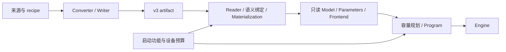
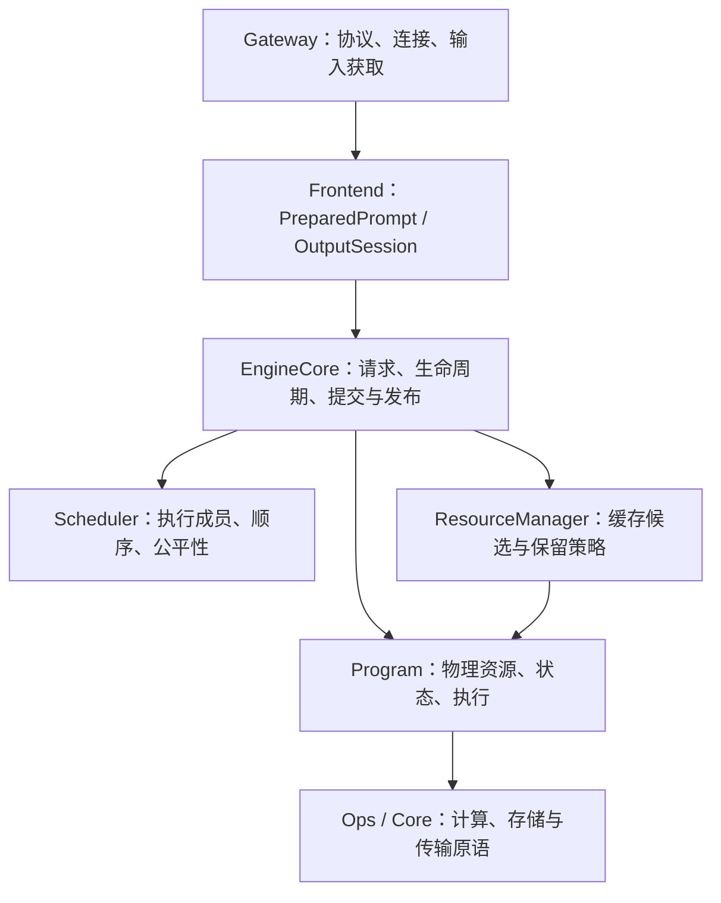
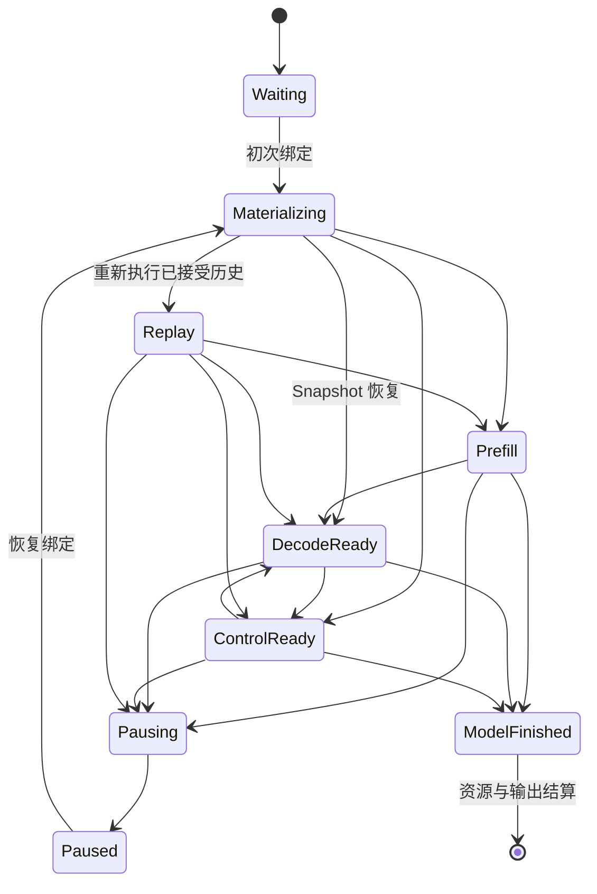

# NInfer Engine 架构

本文定义模型实例、执行所有权、请求生命周期及跨模块提交关系。
[资源调度与上下文缓存](resource-scheduling-and-context-cache.md)定义缓存与抢占策略；
[Paged KV Context Store](paged-kv-cache.md)定义物理页、replica、地址空间与 consumer 合同。

## 1. 产品执行模型

Generation Engine 使用一张 GPU、一个常驻模型和启动时确定的 `max_concurrency=1..8`。
有界等待队列按提交顺序组织；resident 请求按有限执行单元增量取得资源，资源压力下可以暂停与恢复。
每轮将具备执行许可的 decode-ready 请求组成一个紧凑批次，prefill 与 Replay 分块穿插执行。

Text、Vision、prefix reuse、MTP、DFlash/DFlash2、CLI 和 HTTP serving 都通过公共 `ninfer::Engine`。
Speculative backend 属于 Program 内部执行路径，与 ordinary 共用请求调度、提交及结果发布机制。
Artifact 必须提供 Text；启动独立选择 Vision，以及 none 或一个 spec 后端，只绑定和准备所选功能
及其共享依赖。

Engine 的 purpose 在启动时固定。CausalScoring 用于离线文本评分，`CausalScoreCore` 串行调用
Program，窗口使用临时 State 与 Main KV，不进入 Generation Scheduler 或上下文缓存。
评分专用 staging 只在 CausalScoring 启动时分配。

### 1.1 架构、实例与权重

模型代码拥有数学公式、调用顺序、组件交接和状态转移。Config 提供层数、维度、Attention/GDN
分布和 expert 几何等实例参数。架构入口为 `Qwen3_5ForCausalLM` 与 `Qwen3_5MoeForCausalLM`；
训练实例和物理权重分配作为数据进入对应实现。

V3 artifact 保存配置、物理对象、逻辑参数 Binding、使用位置的 Use 和 Frontend 资源。
Converter 负责源映射、量化或保值导入、融合存储、packing 和 layout 转换；loader 根据实际绑定
验证、读取并上传原字节。相同架构和可处理的配置更换训练权重或组合已有表示，沿用同一模型代码。



`metadata.name` 提供公开实例名称，缺省使用架构名称；服务可以用 `--model-id` 覆盖公开别名。
执行选择依据架构、配置和实际绑定。文件合同见[容器规范](artifact-container.md)，权重的数值解释
与 planes 见[数值格式](tensor-formats.md)和[存储布局](storage-layouts.md)。

## 2. 所有权与调用边界



### 2.1 Gateway 与 Frontend

Gateway 拥有协议解析、transport、media acquisition、response schema 和连接生命周期。
它将 product/protocol input 转为公共 owning input，调用 Engine，读取输出与统计。

Frontend 拥有 tokenizer、chat template、Vision preprocessing、MRoPE prompt construction 和
owning `PreparedPrompt`；每个请求独占一个 `OutputSession`，解释 stop、thinking/content channel、
detokenization 及模型私有结构化输出。它还提供能够由模板历史精确重建的输出边界语义。

Frontend 可以预览一次模型输出的语义效果，Engine 提交后才发布。等待顺序和物理缓存均由下层拥有。

GBNF、JSON、JSON Schema、choice、regex 和工具约束的 compiled grammar 在 Frontend 内按词表共享，matcher 由每请求的 OutputSession 持有。
Engine 在 submit 调用线程完成编译，再入队；Program 借用当轮的 mask provider，将 mask 送给
GPU 采样及 spec 验收。Matcher 与输出一起 preview/commit，抢占和 Replay 保留其已提交状态。
执行时序及语义见[约束解码设计](constrained-decoding.md)。

### 2.2 EngineCore 与 Scheduler

EngineCore 拥有 request record、等待队列、resident slots、paused queue、cancellation、deadline、
response event 和 Engine availability。它编排 admission、资源事务、有限执行单元和终态结算，
保证模型提交、输出提交及用户可见事件的顺序。

Scheduler 拥有执行成员与公平性规则：fresh admission 的有限绕过、prefill 轮转、紧凑 decode/control
批次、抢占受害请求及恢复机会。它使用请求状态和提交顺序做决定，暂停请求局部等待容量事件。

Lane 是 resident 请求位置；StateImage slot、KV execution row 和 compact batch row 是独立身份。
暂停释放 lane 后，请求仍由 EngineCore 拥有；恢复可以取得另一 lane。

### 2.3 ResourceManager

ResourceManager 拥有私有 continuation owner、其恢复点、共享前缀索引、session 提示、保留优先级
与可选保存准入。它向 Program 查询实际 checkpoint 内容、传输需求和有限物理动作，选择 source，
按恢复损失、当前缺口和真实需求证据选择回收动作，再采用 Program 返回的结果。

State slots、Device pages、Host bytes、共享引用和 pin 的实际占用只存在于 Program stores。
ResourceManager 的索引和保留记录不构成第二份物理账本。

### 2.4 Model 与 Program

Model 拥有 config、绑定、Use、权重 backing 和只读资源。ModelInstance 的 const Parameters 借用
这些资源，规划和执行消费同一份参数。

每个 Program 独占：

- active sequence、committed prefix identity、执行 ledger 和 backend 状态；
- StateImage、KV history、Device/Host replicas、leases 和 reservations；
- prefill、ordinary/speculative decode、forced control 与 Replay；
- provisional model state、accepted-prefix commit/rollback；
- workspace、CUDA Graph 和固定模型调用。

Program 将具体状态和物理可行性通过原生合同提供给 runtime。请求顺序、缓存价值和输出发布由 runtime
与 Frontend 决定。

### 2.5 实例生命周期与固定执行

Binder 按架构/config 解析所选功能的逻辑需求，Materializer 建立稳定 backing 并上传原字节。
ModelInstance 持有 Model、const Parameters、Frontend 与 Program。Planner 查询各层及后端需求，
结合权重驻留后的 Device 余量解析容量，建立最终布局。

权重、State/KV backing、block-table matrices、workspace 和 CUDA Graph resources 在接受请求前建立。
运行期改变 ownership、mapping、frontier 与 replica placement。每个 Program 独占可变状态和 Device
allocation；销毁时先结束 Engine worker 与未决设备工作，再销毁 Program、Frontend、Parameters 和 Model。

模型代码维护有限调用写法、跨 Op 融合和阶段关系。例如 Q/K 为一个 Q4 parent、gate/V 为一个 Q5 parent
时，Attention 投影使用两个权重参数；完整 FP8/NVFP4 parent 保存 Q/K/gate/V 时使用单权重入口。
View 保留 parent 几何、planes 和元素范围，共享对象只驻留一次，各使用位置保留独立 Use。
激活许可为 `A16Only={A16}`、`AllowA8={A16,A8}`、`AllowA4={A16,A8,A4}`；融合调用取相关许可交集。

Reader、binder、原生参数准备、容量查询、warmup 和执行各自检查所消费的合同。可执行范围由实际
消费者决定。数学公式、权重表示值和实现精度分别解释；不同量化、batch、prefill 或 speculative 路径的
数值与状态正确性按 [Op 合同](op-development.md)及独立 oracle 验证。

## 3. 请求生命周期



`Materializing` 包含 source lease、必要传输和 destination 安装；完整绑定采用后才暴露 SequenceHandle。
Capture 是 resident 请求上的暂时执行门，capture 未完成的请求不进入模型 unit。
`ModelFinished` 表示模型已经结束，Engine 仍持有 lane，直到 finish/release 和缓存索引更新完成。
取消与失败可以从相应稳定边界进入终态。

### 3.1 暂停与恢复

暂停由 Program 在已提交 GPU 边界完成，返回 owning `ResumeState`：

- Snapshot 保存可直接恢复的完整 State/KV coverage；
- Replay 保存继续请求所需的输入、accepted ledger、RNG 和 backend 控制状态，恢复时重新执行缺失历史。

Engine 保留同一个 request record、OutputSession、generation budget 和已发布结果。Replay 重建物理状态时
不重复发布历史输出，也不重新消费用户生成预算。Snapshot 是可回收的加速资源；撤销后该请求仍能 Replay。
恢复绑定取得“重建至旧 frontier + 首个真实新单元”的完整许可，Native 跨 chunk 保持实际预留。
同时最多一个请求处于这段受保护恢复中；真实新进展或终态结束许可，随后再尝试其他恢复。
这期间跳过可选 capture，其他已获许可的请求仍可执行。

### 3.2 Outstanding capacity

非零输出请求成功 submit 后占一个 outstanding 名额，暂停不归还该名额。释放同时要求：

```text
response_done       worker 已形成最终 result 或 error
consumer_released   wait 已结束，或 GenerationHandle 被放弃
```

两者可以任意先后，capacity 只释放一次。放弃句柄只设置 cancellation 和 `consumer_released`，
consumer thread 不调用 Program。

### 3.3 Continuation 与 session

Active continuation 是可写模型状态；checkpoint 为不可变的恢复点。完整 checkpoint 对齐 State、
Main KV、selected backend KV 及继续执行所需 metadata。一个私有 owner 可持有多个恢复点并共享 KV history。

Session key 提供 continuation 查找提示。每个请求拥有单调 `publication_order`；较早提交的请求晚结束时，
不会覆盖较新结果的 session binding。具体恢复点与共享发布规则由
[上下文缓存](resource-scheduling-and-context-cache.md)定义。

## 4. Worker、资源与执行

只有 Engine worker 修改请求运行状态、Scheduler、ResourceManager 和 Program。Ingress、consumer 与
transport 通过队列、原子 cancellation flag 和 response event 交互。

一个 worker cycle 先推进资源事务、capture 与终态并处理取消，在容量事件上尝试最老 paused 请求
的完整恢复。随后按恢复优先、原票号优先为 resident 逐行取得 unit 许可，用余量尝试 fresh admission，
再执行可运行的 control、decode 和一个 prefill/Replay chunk。受保护恢复优先取得 chunk；其余 prefill
在 resident 间轮转，decode 批次使用实际 `B`。

Program 的 `reserve_units` 原子取得一个调用集合的 typed 增量需求；Engine 逐行调用，组成可运行
子集。一行缺资源不会阻止其他已许可行执行。普通 unit 结算释放未用 reservation 与 provisional
suffix；恢复许可保留未来重建及首新单元尚需的 reservation。压力可以回收 optional cache、撤销
paused Snapshot 或暂停年轻 resident，具体准入与公平性见核心缓存文档。

一次资源事务可以与不受影响的 resident 执行交错，但同一 sequence、source/destination lease、
block table 和 transfer buffer 的依赖由 Program 冻结。任意时刻只有一个上下文资源事务，任意 GPU unit
访问的 mapping 在完成前保持稳定。

Admission 检查由等待队列、容量释放、资源事务完成等事件启动有界扫描。普通 decode 前进本身不重启
失败的 admission 扫描。恢复失败不关闭 fresh admission；更老 resident 仍在时，paused 请求不会
为试探恢复而盲目暂停年轻 borrower。普通 active 请求不预留整个剩余生成长度。

## 5. 提交与发布

### 5.1 上下文事务

Bind、Capture、Demote、Pause 使用同一事务驱动：

```text
选择操作与 source
  -> Program 取得 destination reservation 和 source lease
  -> 分步传输与完成检查
  -> 发布完整物理结果
  -> Engine / ResourceManager 采用结果
```

Program 持有事务期间的物理所有权，返回新 sequence、恢复点、已退役 checkpoint、暂停状态和 transfer
观测。Source 在所需数据复制与验证完成前有效；abort 清理预留和传输，不发布不完整 destination。
已安全完成的回收或降级可以保留，结果必须与最终实际占用一致。

### 5.2 模型 unit 事务

Prefill finalization、decode 和 control 可以产生 move-only `PendingBatch`，包含冻结的 sequence
membership、provisional token、每行 produced extent 和 accepted-prefix 执行 metadata。
Engine 使用 Frontend preview 形成每行 decision，再一次性 `Program::commit` 或 `abort_pending`。
Program 提交或回滚对应 Main/backend KV、recurrent state、RNG 和 speculative state。

非取消行满足：

```text
1 <= accepted_tokens <= produced_tokens
nonterminal -> accepted_tokens == produced_tokens
terminal    -> accepted_tokens 可以是 produced prefix
```

取消行使用零 accepted token。整个 PendingBatch 必须被消费，不能逐行遗弃未决状态。

### 5.3 输出顺序

```text
Frontend preview
  -> Program 提交 accepted model state 与 prefix execution provenance
  -> generation budget 与调度记账
  -> OutputSession 提交 preview
  -> 发布输出事件
```

Frontend 的 boundary metadata 只描述 accepted span 内的相对位置；Engine 验证范围并随 row 搬运。
Program 根据 base frontier 转为绝对位置，与 accepted token、State/KV 和 prefix digest 原子提交。
Program commit 失败时，OutputSession preview 也不提交。

Forced control 使用同一提交机制，token 由 Frontend 提供，不调用 sampler 或推进 sampling RNG。
初次 admission 确立后，在任何输出 delta 前发布一次 `GenerationStart`；抢占恢复不重复发布它。
最终 response 等待 terminal 资源及缓存 owner 结算完成。

## 6. 结束、取消与失败

成功结束时，Program 将可保留 continuation 交给 ResourceManager，或释放 sequence；ResourceManager
更新私有 owner、共享索引和 session，然后 Engine 释放 lane、完成 response。

取消在 worker 边界生效：Waiting 直接结束；绑定或传输中的请求先结算/中止事务；resident 请求在
GPU unit 稳定后 abort；paused 请求释放 ResumeState 及相关 owner。取消不改写 in-flight mapping，
已提交输出不回退。

Queue timeout、overload、输入超限和 request 无法表示属于请求级拒绝。Handle generation/owner
错误、PendingBatch membership 错误、物理 mutation 无法稳定 commit/abort，以及完整性或 adoption
不变量损坏会使 Engine 失败。Cleanup 先结束未决上下文和模型事务，再释放 resident/paused 资源与
缓存，最后完成全部 response。内部状态损坏不能解释成 cache miss。

## 7. 物理执行与 CUDA Graph

Startup planner 根据与执行同源的逐层 Parameters、Use 和设备容量建立 State/KV、workspace 与
Graph 资源。顺序互斥 scratch 取峰值，跨阶段存活的数据保留到最后消费者：Vision handoff 保留至
Text/所选 MTP 消费结束，speculative features 和 verify records 保留至提交边界。

Growing KV 使用共享 typed paged pools，物理页与逻辑 token frontier 分离。所有预留、mapping 更新、
COW 和 replica publication 在 GPU 稳定边界完成。消费者只拿 non-owning typed views。

CUDA Graph 按合法 exact-`B` topology 建立，page ID、请求身份、state selectors 是输入而非 graph key。
Op 拥有声明执行范围内的 Graph 更新兼容性，Program 在启动时捕获并验证同类更新。
Speculative unit 使用 Forward、Finish 两段 Graph，CPU 在两段之间准备约束 mask，并可与 target
forward 重叠；两段共享同一个资源预留和提交边界。
长度档位限制资源范围；Program 不复制 Attention Op 私有 kernel 的分派边界。

Source 排序使用硬件与实际绑定对应的传输成本、prefill 成本；缺省值用于没有匹配测量的配置。
实际 reservation 和 stores 决定物理可行性。

Serve warmup 使用公共 Engine，但关闭请求级 context cache；结束后不留下可供外部请求命中的
continuation 或 checkpoint。

## 8. 核心不变量与实现位置

1. Engine worker 是请求运行状态和物理 mutation 的唯一执行者。
2. Scheduler 决定顺序，ResourceManager 决定逻辑保留，Program 决定物理可行性与状态操作。
3. Unit 执行前取得完整许可；恢复许可跨 chunk 保留至真实新进展，执行中的资源和 mappings 稳定。
4. Checkpoint 必须对应同一次实际执行的完整 State/KV coverage。
5. 暂停保留请求语义和已发布输出，恢复不重复输出与生成记账。
6. PendingBatch 完整消费后才能发布对应输出；终态结算前请求保有资源所有权。
7. 每个请求、资源事务和模型事务均有唯一终态。

| 职责 | 主要位置 |
|---|---|
| 公共 Engine facade | `include/ninfer/engine.h`, `src/runtime/engine/engine.cpp` |
| 请求生命周期、调度与观测 | `src/runtime/engine/engine_core.h`, `request_record.h`, `scheduler.h`, `engine_metrics.inl` |
| 实例构造 | `src/runtime/engine/model_instance.*` |
| 缓存 owner、索引与成本 | `src/runtime/engine/context_cache/` |
| 公共请求、执行与资源合同 | `src/runtime/contract/` |
| 模型 config、绑定与只读数据 | `src/models/qwen3_5/config.*`, `load/`, `model.*` |
| 原生参数与固定模型调用 | `src/models/qwen3_5/execution/` |
| Program 规划、存储、上下文及模型事务 | `src/models/qwen3_5/program/` |
| Frontend 与模型状态布局 | `src/models/qwen3_5/frontend/`, `state/` |
| Tensor、arenas、graphs、物理 KV 与 raw transfers | `src/core/` |
| 通用 artifact framing 与 materialization | `src/artifact/` |
| 闭合计算与状态转移 Ops | `src/ops/`, `include/ninfer/ops/` |
| 输入转换、media acquisition 与 HTTP Gateway | `src/product/`, `src/media/decode/`, `src/serve/` |
| Converter 与 Python 容器工具 | `tools/convert/`, `tools/artifact/` |

公共 C++ 接口服务仓库内应用；NInfer 不安装或导出 C++ SDK。V3 `.ninfer` 是唯一 C++ 产品 artifact，
CLI、server 和 inference benchmark 均通过公共 Engine，converter 不提供 Python model-inference 路径。
