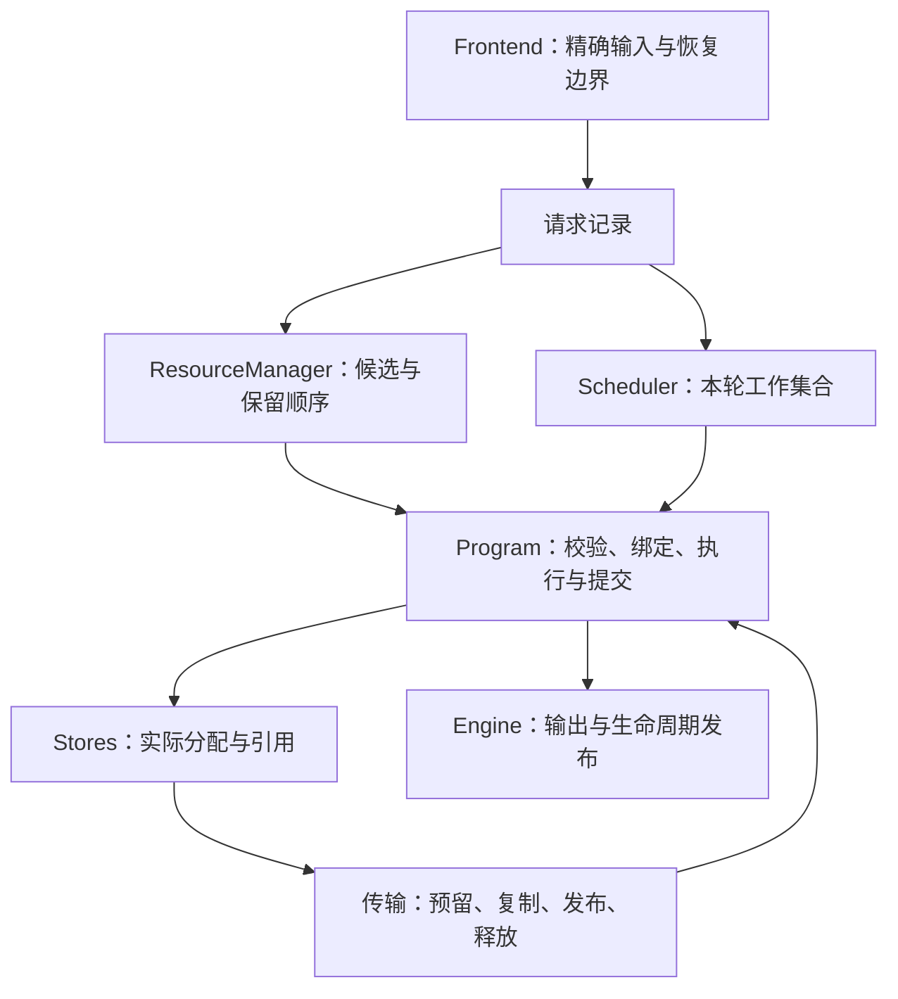
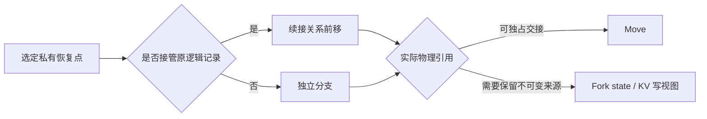

# NInfer 资源调度与上下文缓存

本文说明 Generation 如何在有限显存和 Host RAM 中协调请求执行、上下文复用与抢占恢复，是这些
策略的设计权威。全局执行与发布关系见 [Engine 架构](engine-architecture.md)，KV 的物理布局、
页表和消费者约束见 [Paged KV](paged-kv-cache.md)。

## 1. 核心思路

NInfer 在单 GPU、单常驻模型、启动固定的 1–8 个执行槽上运行。Hybrid 模型复用一个前缀，需要
该位置的完整 recurrent state 和连续 KV 覆盖。KV 可以逐页共享，recurrent state 则是某个位置
的完整恢复镜像。因此，缓存管理同时使用三个单位：

- **续接记录**管理一条历史的恢复位置、命名入口和真实复用资格。
- **检查点**表达可以恢复的精确位置、StateImage 与各后端 KV 覆盖。
- **物理对象和副本**承担实际占用、共享、传输与释放。

普通执行按下一单元增量预留资源。工作集增长到无法共同驻留时，暂停较年轻的请求，优先推进
较老请求。恢复另外取得覆盖旧 frontier 和首个新单元的完整许可，直到产生新进展再归还余额。
请求的已提交历史与输出语义跨暂停保存，设备绑定可以重建。

缓存重点服务多轮对话、agent 工具往返、输入重试和共享前缀。保存机会来自输入语义与请求生命周期；
prefill chunk 仅切分调度工作，不自动保存 state。真实采用和重复计算的需求证据决定热度；
回收在 Native 给出的有限物理动作中，比较实际恢复损失与当前稀缺资源。

<a id="ownership"></a>
## 2. 所有权与调用关系

| 部分 | 拥有的事实与决定 |
|---|---|
| Frontend | 模板渲染、token/位置/媒体身份、typed rewrite 与实际输入恢复位置、共享 marker 的精确边界 |
| Engine 请求记录 | 原始票号、输入与输出对象、预算、取消、首次时间、跨暂停的续接关系 |
| Scheduler | 执行成员、fresh 扫描与有限越过、prefill/replay 轮转、抢占和恢复门控 |
| ResourceManager | 私有续接与公共条目、前缀索引、等待引用、需求证据、来源选择与回收权限 |
| Native Program | 模型账本、后端 frontier、完整恢复点、工作单元需求、状态提交与恢复 |
| Program 内的 stores | State、KV、Host backing、引用、reader lease、预留和副本的真实占用 |



Runtime 从 Program 查询真实占用和可释放量。逻辑记录可以共享同一份物理内容，解除一个记录也
可能释放零字节。检查点所有者要求内容保持可恢复；reader lease 则保护本次实际读取的副本，直到
计算或传输完成。缓存记录的保留等级不等于整条历史被 pin。

一个 Engine 控制线程推进策略、事务和引用结算。Program 拥有自己的可变 state、workspace、
context stores 和 CUDA Graph，不与其他 Program 共享可变分配。

<a id="capacity"></a>
## 3. 容量与执行许可

### 3.1 启动容量

Device 按模型的实际布局准备 Main KV、所选 backend KV、StateImage、workspace 和 Graph 空间。
Main KV 页为 64 token；每种 KV 的物理字节数由其层数、几何和存储格式决定。

| 配置 | 当前含义 |
|---|---|
| `max_context` | 一个请求的逻辑上下文上限 |
| `kv_capacity` | Main KV 物理池的 token 等价容量，按页舍入；也可由启动显存预算自动求解 |
| `max_concurrency` | 同时占用执行绑定的上限 C，范围 1–8 |
| `context_cache.device_state_slots` | C 个基本 Device StateImage 之外的额外槽数，缺省为 C |
| `context_cache.host_capacity_bytes` | StateImage、Main/backend KV、暂停快照及传输目的共用的 pinned Host 字节容量 |

Main KV 容量曲线的页数下界为 `max(ceil(max_context / 64), C)`，上界为
`C × ceil(max_context / 64)`。下界分别满足单请求独占最大上下文和 C 个最小页的几何要求。Native 同时
计算所选后端、state、workspace 和 Graph 的布局；显式或自动容量都要落在这条曲线内并满足可用
显存。容量并不平均切给每个 lane。

Host 缺省容量为 `8 GiB + 8 × 当前模型 Host StateImage 大小`。它是一个共享 backing，State 与
KV 的分项占用用于观测，不能再次相加成额外配额。传输目标从预留时就计费，发布只改变其状态，
不减少占用。Host extent 的分裂、最后引用释放和合并由 allocator 管理。

必要请求输入、token 账本、prepared media、Responses 存储和 Frontend 媒体缓存各有自己的
生命周期与现有数量、长度或媒体预算约束。Host context 容量不覆盖这些内存，也不限制进程总 RAM。
物理容量同时约束 Native 元数据规模；空逻辑记录和索引分支及时删除。

### 3.2 执行与恢复许可

Program 根据实际绑定状态计算 Prefill、Replay、Decode/Verify、Control 或 Normalize 的 typed KV
覆盖，包含 speculative 峰值与后端需要。State、缺失副本和尾页 COW 在绑定或捕获时另外取得。
一次 unit 的多个 typed pool 申请共同成功，失败归还本次部分预留并返回具体缺口。

Engine 按恢复优先、原票号优先取得 resident 单元许可，形成可运行子集；一行暂时不足不会阻止
其他已许可行执行。Fresh admission 使用余量，不能花掉现存许可。普通 unit 结算释放未用预留，
后续增长继续按需申请。算子内部不选择缓存受害者。

同步回收已经改变容量时，当场重试当前许可；需要等待传输完成时才交回调度周期。

暂停恢复一次取得完整 State、缺失 KV、尾页以及“重建至旧 frontier + 首个真实新单元”的覆盖。
Native 跨 Replay chunk 持有尚未物化的真实 reservation；到达旧 frontier 或完成 bridge 不解除
保护。新 prefill 提交、生成/control 提交新 token 或请求进入终态后，恢复许可才结束。

一个请求可以暂时独占大部分 KV。回收可选缓存并暂停其他请求后，唯一请求仍无法取得合法单元时，
Engine 报告容量合同错误，不等待不存在的释放者。

<a id="checkpoints"></a>
## 4. 续接记录与完整检查点

### 4.1 私有恢复位置

私有记录保留一个生成终点 E、一个输入侧恢复点，以及最多四个显式私有长锚点。

| 位置 | 用途 |
|---|---|
| E | 已提交的生成终点，服务包含上轮输出的续接 |
| typed R：`ResponseReplay` | 当前 assistant 响应开始前，表达重试、结构化 tool call 与规范化历史的改写上界 |
| typed R：`TurnClosure` | 当前真实 user 后的首个 assistant 开始前，表达新用户轮次对 open turn 的改写上界 |
| `recovery_frontier` | 实际保留 State 的输入位置；可与 R 相同，或位于能精确补算闭合结构的较早内容边界 |
| P | 没有 typed rewrite 的 raw/token 输入终点 |
| 显式私有锚点 | 调用者指定的其他有限恢复位置 |

Frontend 根据模板渲染和 next-user probe 选择 typed R，再独立决定实际恢复位置。例如：

```text
[user header][正文] C [模板闭合结构] R [assistant generation header] P
```

只有当 provenance 证明 R 前紧邻 User/System/Developer 消息的 C→R 纯属模板闭合结构、没有
遗漏内容或媒体，且 C 能映射
为精确 token frontier 时，实际保存 C；恢复后重新计算闭合 token。否则保存 R。这一选择来自 typed R
对应的消息结构，与本次自动共享 marker 位置无关。输入规划、source 携带检查使用同一恢复位置。

`rewrite_execution_frontiers` 另行约束数学执行的切分，可能位于 assistant header 之后。
实际恢复位置前移或可选保存失败都不改变这些数学边界。

从较深 E 恢复时，Native 携带仍精确兼容的输入点。需要更靠后位置时，旧点可在申请新目的之前
退休；新保存失败不恢复旧点。较早 state 不能从更深 state 倒推。每次生成不另存固定 P 镜像；
同位置用途可以共享物理 state。锚点同位置更新，超限替换最旧发布点；无法安全替换则放弃本次保存。

### 4.2 完整性与身份

检查点包含精确输入身份、Native frontier、不可变 StateImage 和所需的各 typed KV 覆盖。
StateImage 包括 GDN/conv、continuation hidden，以及所选后端的必要 local state。Main、MTP、
DFlash 的 frontier 分别解释，由模型代码保证相容。

普通生成通常有：

```text
execution_frontier = 已计算 KV/state 的长度
ledger_frontier    = execution_frontier + 1
ledger[execution_frontier] = 已提交、下一次待输入的 token
```

精确命中可以使用保存的 tail hidden 进入采样。MTP 的 frontier−1 bridge、DFlash context
append 和 speculative accepted-prefix fold 由 Native 完成。尚未提交的 suffix 不成为恢复点。

前缀索引的 digest 用于缩小候选范围，采用前还要校验 token、位置、媒体与执行身份。独立重算得到
的 state 与 KV 不能因为 token 相同就拼接；共享页和跨介质副本沿用其真实内容身份。

### 4.3 共享用途与自动边界

公共共享条目是可供多个请求分叉的独立入口。它与私有实际恢复点同位时，两种逻辑用途都保留，
物理对象按引用共享。Frontend 将最多四个调用方 marker 解析为精确 frontier，同点合并，按序提供
保存机会。较浅位置仍可服务后来改变的后缀。

产品入口选择自动 marker，Frontend 验证其实际序列化边界：

- OpenAI 默认选择最后一个可缓存 source part 的末端；结构化 tool call 使用其消息边界，没有消息
  内容时可选择 tools 边界。正文继续增长时，先前 source part 的 token 前缀仍一致就可以复用。
- 自动提示与同点显式 marker 合并；四个显式位置占满时自动提示让位。显式消息边界仍按调用方
  指定位置解释，不改成内容边界。
- Responses 展开存储历史并规范化本次输入后应用策略；原始存储输入不携带新增自动 marker。
- 允许模型自动结构位置的其他输入，Frontend 可提供 leading instructions、tools 等有限机会。

Source provenance、tokenizer 的精确 frontier 和完整媒体范围共同决定位置是否有效。字符串追加
可能改变 BPE 尾 token，因此 source-part 位置仍须通过真实前缀匹配。协议参数见 [Serving](../serving.md)。

## 5. 保存与物理交接

### 5.1 保存机会

保存来自实际输入恢复点、显式锚点、共享 marker、正常生成终点，以及实际抢占需要的执行快照。
Prefill/Replay chunk 结束本身不产生保存机会。

Engine 在跨过语义 frontier 前调用 Native 准备目的 state、检查点描述与必要尾页空间。私有输入
点可先退休本记录已经过时的输入点，再尝试 Device 槽，容量不足时可使用 Host。私有输入点共用
原 KV 历史，只增加恢复 state 与保护 frontier；公共条目需要独立视图时，另取得必要的尾页复制空间。

同点兼有私有与共享用途时，共享部分不足仍可保留私有点。捕获属于可选缓存写入，回收须通过
新增恢复收益与被替换内容的准入检查，不抢占 active 请求。没有合适空间就跳过保存，继续必要执行。
已有兼容输入点直接携带；完整恢复许可生效期间跳过可选捕获，必要数学分界仍执行。

### 5.2 历史、Move 与 Fork



非活跃且允许更新其入口的私有记录可被接管。已有独立请求占用该关系、跨命名入口等情况保留父
记录并建立分支。公共别名或物理 reader 决定是否需要 Fork，并不要求保留一个额外私有父记录。

同一历史的 E、输入点和锚点引用一份 KV 目录及各自覆盖。保存内部输入点不复制整套 KV，也不因其位于
部分页就额外复制尾页。从较早输入点重算时，绑定先检查退休后的实际可用资源，接纳后退休获准
替代的更深私有点，再按剩余保护范围裁剪。
独立分支或公共视图共享完整页，必要时复制未满尾页，保持一个可写历史与外部不可变内容隔离。

不可变 state 与 active writer 分开。可独占 E 直接 Move；需要保留来源时，Fork 可由下一次计算
完成 state 转移，后端必要 local copy 仍执行。Device 槽紧张且有 Host 副本时，可以保留旧身份的
Host 内容，将 Device 槽交给新的 active identity；只有 Device 副本则先完成 D2H。无法兼顾保存
与执行时，允许放弃可选恢复点，reader lease 始终保留。绑定退休旧点腾出的 Host 空间也可用于
保存输入点。

正常结束将合法执行态 freeze 为新 E。取消可以使本请求已接管的可选旧缓存消失，其他独立所有者
继续有效。Session 是查找提示和命名入口，较旧请求晚完成不能覆盖较新的 `publication_order`。
未命名历史仍可按精确内容复用。

<a id="sources"></a>
## 6. 来源查询与绑定

一次接纳或 Replay 恢复查询命中路径上的私有和公共完整点，并包含 root。Native 逐个检查精确
匹配、允许的最大 frontier、可携带私有点和物理交接方式。

候选按“恢复传输成本 + 剩余 prefill 成本”排序。成本相同时依次考虑搬运字节、更深复用位置、
合法 session 提示、私有用途、较新 publication order 和稳定序号。同一 Native handle、相同
接管方式与携带点的重复候选合并；独立计算得到的同语义位置仍分别处理。

来源成本模型比较当前恢复传输与剩余计算。机器传输与 artifact prefill 校准影响排序，不决定
内容是否可恢复。缓存回收另用实际恢复覆盖损失，不估计未来请求概率；实际许可由 Native 申请。

来源评估只读。Native 计算来源的 Move/Fork、兼容携带点与获准退休的旧点，并根据首个合法单元
检查 State、缺失 KV、增长页和尾页需求。暂停恢复仍检查完整恢复许可。实际回收可以改变副本与
容量，随后重新读取事实；一次失败的绑定尝试不退休候选相关的旧点。

有价值的来源暂时受 resident 或在途工作占用阻塞时，请求保留来源并等待。Root 首个 chunk 较小，
不构成放弃已有恢复位置的理由。来源失效、被撤销、实际成本排序变化，或绑定路径的必要页数超出
物理池容量时，可以重新选择。没有真实释放者且合法回收仍不足时，尝试其他来源；隔离请求的 root
也无法取得合法首单元，则报告容量合同错误。自己的完整 Snapshot 优先兑现，不因其他来源便宜
而主动丢弃。Snapshot 直接以自身检查点和本请求的携带点构建绑定。

等待请求引用同一个 Native 检查点，并携带本次兼容的输入恢复点与有限锚点。等待不分配新 State/KV，
不占 lane 或后续执行许可，但会延长已有资源的生命周期。目录被替换后，等待引用仍维持完整性；
仅由等待者保留的点不作为新的公共目录入口。查询、保留和等待不产生使用热度或缓存命中。

等待保护允许 Device/Host 副本迁移，与实际读取期间的 reader lease 分开。可选缓存写入不能删除
等待者保有的完整点；fresh 接纳只能撤销较年轻等待者的保护，不能撤销 paused 快照。已接纳请求的
必要推进和合法恢复，可以在普通回收不足时撤销等待保护。回收先选择能补足实际缺口的完整物理动作，
核对全部持有者；共享引用不重复计费。需要撤销时优先考虑较年轻等待者，撤销记录使受影响请求重新选择。

绑定将逻辑接管与物理消费分开。请求自己的等待引用可以直接交接，其他等待者仍是外部保留者。
只有在完整绑定能够成功时，才兑现为 Move 所授予的等待撤销权限。原 owner 已前进或换代时，旧等待者
建立独立分支；重新查询也不能接管 publication order 晚于本请求的记录。其独占的旧检查点仍可以 Move。

Native 在提交前准备请求元数据，检查并利用退休旧点可释放的真实资源，然后取得读保护与预约、执行
所有权交接。成功接纳后不再尝试其他来源；搬运与依赖完成后安装状态，ResourceManager 才记实际使用
和接管关系。等待引用随采用、重新选择、取消、超时或关闭释放。在途 reader 由 Native 事务完成或中止
后释放。请求在接纳后取消，仍可能失去已经退休的可选旧缓存。

<a id="retention"></a>
## 7. 保留与回收

### 7.1 真实需求与两段保留

私有记录和公共条目各有普通/复用等级。私有 owner 将真实需求时刻与实际采用位置
`proven_frontier` 成对保存。Consume 按本次 source 重设这一对；Fork 子记录取得本次采用的时刻和
位置。Fork 从父记录较浅位置启动时，父记录保留原有一对证据；source 已覆盖父记录的证明位置
时才更新父记录。公共使用独立更新公共条目。完成、单纯保存、搬运和自己的暂停恢复不刷新证据。

另有最多 256 项的需求摘要，记录有限候选位置的 digest、frontier、identity tag 和实际请求观察。
成功采用非零跨请求来源时，记录该精确采用位置的重复需求；新 prefill **提交并跨过候选位置**时
记录计算需求，同一请求同一位置只记一次。两个不同请求的真实计算也能证明重复需求，即使此前
没有物理副本可命中，后续捕获仍能取得该位置的复用资格。
Rendering、候选查询、轮询、自己的 Snapshot/Replay 恢复和单纯保存不产生观察；摘要命中只影响
保留与准入，不增加 cache-hit 或 reused-token 统计，也不持有 State/KV。输入恢复点因这份真实
重复需求证据提升私有 owner 时，同时把证明位置设为该输入点。

复用段按最近实际采用或重复需求时间排序，以各物理池容量的 3/4 为软目标，降级较老记录。
计费使用唯一物理 footprint；单个最新的大记录可超过软目标。等级决定回收次序，不承诺永久保留。

### 7.2 有限物理动作

Native 根据实际 State/KV 引用枚举有限的降级和删除动作，每个动作携带真实持有者集合、可释放量
与必要传输。共享内容的所有可选持有者必须一起满足准入；active/transfer reader 另外限制能否
动它。释放零个当前稀缺资源的动作不参加比较。

同一次同步报价共用历史持有者、物理页归属与精确前缀关系，迁移和删除候选使用同一组事实。
Runtime 将候选的恢复损失与保留资格用于各项准入检查和排序；权限分别检查，事实无需重复计算。
这些评估资料不取得资源引用或 reader lease，资源、引用发生变化或交回调度周期后即失效。
提交仍针对选中对象核对当前完整持有者、内容版本与 pin，再取得真实预约。

私有热保护对应其已证明的采用位置。同一 owner 真正幸存的较早、精确兼容恢复点仍覆盖这个位置
时，更深且尚未证明的新后缀可以按普通边际损失处理；过浅的输入点不能代替曾实际采用的深位置。
独立 Shared 热所有者仍保护涉及它的完整物理动作。降级与删除使用相同的保护判断。

每次按当前处理的 typed 缺口比较；Device 内优先处理 State，再处理 Main/backend KV，Host 目的
单独预检。Runtime 在这个稀缺单位内排序：

1. 普通内容先于复用内容。
2. 普通动作比较“边际恢复 token 损失 / 对本次缺口有用的释放量”，同分按保留顺序。
3. 复用动作按最近真实需求时间，优先处理较旧内容。

删除损失依据动作后的真实 surviving fallback 计算。嵌套 E、输入点与 Shared 不重复累加同一
历史的覆盖；同时删除的别名不能充当彼此 fallback。Device→Host 降级在排序前固定所需 Host
受害者，完整动作的净损失包含这些删除。只有无需删除完整恢复内容时才是零损失，不能仅因
Device 来源得到保全就优先。提交前复核同一受害集合，变化后重新报价。

只缺几页时，降级选取满足缺口的有限页组，State 和另一 typed pool 不因同属一条历史而全部搬走。
有完整 Host 副本时直接释放 Device 副本；否则报价并申请 Host 目的。启动动作前重新验证内容和
引用，完成后重新查询真实缺口。

同一个 KV pool 中，按回收顺序选择的迁移组可以共用一笔事务。若中间删除候选实际能释放的目标
Device 页已全部被前面选中的迁移覆盖，它不再增加本次容量，可以略过这个备选；判定依据是
Native 的完整物理页身份，而非检查点名称或名义页数。其他删除动作，以及需要 Host 受害者的
迁移，结束这批。Runtime 检查每组及完整批次的权限，Native 按实际缺口和 Host 余量裁切严格前缀。
全部目的与源 lease 预约成功后才提交，已有完整 Host 副本的 Device 页在提交时释放，其余页在
复制完成后释放。原始候选列表保留，批量预约失败时仍可依次尝试单个迁移和删除备选。

### 7.3 必要执行与可选写入

必要执行可以按上述顺序回收允许的可选内容；其本次 source 和在途 reader 始终保留。可选捕获
及保留现有内容的 Host 写回只拥有自身的准入资格。

新捕获区分候选精确位置自身的重复需求与 owner 继承的保留热度。前者来自该候选的真实跨请求
采用或重复提交的需求观察；按重复需求进行工作集替换时，使用候选自己的需求时刻，不能借用
owner 更新的热度。

| 申请与受害内容 | 准入条件 |
|---|---|
| 新捕获没有候选自身的重复需求 | owner 的保留等级界定可替换范围；固定新增恢复覆盖收益须大于累计删除损失，继承热度也不免除预算 |
| 新捕获已有候选自身的重复需求 | 以该候选的实际需求时间替换普通或更旧复用内容，不以新增覆盖长度限制工作集替换 |
| 既有内容的 Host 写回 | 按所保留内容自身的资格与恢复覆盖收益准入 |
| 暂停 Snapshot | 可选缓存，再考虑票号更晚的暂停快照 |

没有候选自身重复需求的新捕获，在开始决策时固定相对 surviving fallback 的新增恢复覆盖预算。
Host 与 Device 分步删除共用预算，累计已经牺牲的恢复覆盖；不能因删掉 fallback 再抬高申请者
收益。分步损失采用保守累计，可能放弃本可通过更复杂组合保留的点。

准入完成后，私有 owner 的整体保留热度仍可继承真实采用资格；这不赋予它尚未被重复需要的新
捕获位置同等替换权限。

降级的 Host 受害集合同时满足迁移源与外层可选捕获的保留权限，并受捕获剩余预算约束。必要执行需要 Device 空间
不会把自己的权限转授给正在尝试保存的冷缓存。保存没有足够收益或空间时跳过，不阻塞必要执行。

Host 先释放安全的重复副本，再对有限物理动作作完整预检：实际释放并集足额，且联合持有者都能
被本次申请替换，才执行删除。Shared 引用的名义大小不重复累加。预检后 allocator 仍须满足
完整 StateImage 与连续 extent geometry；分配失败可放弃保存，已完成删除不回滚。

<a id="scheduling"></a>
## 8. 调度、抢占与恢复

### 8.1 普通周期

每个周期先处理传输、终态与取消，在真实容量事件上尝试最老 paused 请求的完整恢复。然后按
恢复优先、原票号优先逐行申请 resident 单元许可，保留可运行子集，再用余量尝试 fresh admission。
执行已许可的紧凑 Control/Decode 集合和一个 Prefill/Replay chunk；Control 提交的行下一周期
重新取得 Decode 许可。Graph 使用实际成员数与执行 profile。

Fresh 队列保留 FIFO 票号，每个受阻请求最多被 C 个更年轻请求成功越过。每次扫描检查队首及最多
C 个后续候选，失败检查不消耗额度，未完成扫描按票号继续。没有空 lane 时仍可保留选中的恢复来源。
队列变化、实际容量释放、搬运完成与引用撤销触发扫描，同一事件下已失败的请求不重复报价，普通 decode
不重新开启扫描。Paused 请求的等待只约束它自身，空闲 lane 和容量可服务能够进入的 fresh。

### 8.2 压力与完整恢复

```text
单元缺口 → 可选预留与普通缓存回收 → 必要时撤销等待保护与暂停快照
         → 为最老必要工作收回较年轻 resident，或暂停自身无法前进的年轻行
```

Materializing、已终结和持完整恢复许可的请求不作为抢占对象。暂停发生在 Native 稳定提交边界，
不打断 kernel。已许可的其他请求继续执行，不要求整批全部可放入才运行。

Paused 队列按原票号尝试恢复。存在更老 resident 时，暂停请求只尝试空闲和可选缓存空间；不能
仅为试探恢复而反复暂停年轻 borrower。更老 resident 离开后，最老 paused 可以收回年轻请求占用的
lane 和容量。Fresh admission 不主动抢占 resident。

同时最多一个请求持有完整恢复许可。它优先重建旧历史并完成首个真实新单元，其他可运行单元
继续执行；恢复期跳过可选 capture。Native 持有跨 chunk 的真实容量，Runtime 以
`recovery_pending` 判断保护结束。到达旧 frontier、完成 MTP bridge 或单纯回读 Snapshot 都不算
新进展；新 prefill、生成/control 提交或终态才结束保护。

Prefill chunk 的边界为已经驻留的请求提供轮转机会。全部 lane 被占用时，新请求仍要等到某个
resident 结束、取消或因资源压力暂停；缩短 chunk 本身不会使它提前进入。因此，短请求排队可能
跨过长请求的多个 chunk，分析这类时延要分别检查 lane 准入和每个执行单元的耗时。

Engine 在轮首、准入后的执行选择前、Control/Decode 后各有界推进上下文事务。已完成的绑定
及时进入原有许可与语义 capture 流程；Control/Decode 执行后只刷新尚未执行的 Prefill/Replay
许可，每轮仍为一个 compact decode batch 和一个 prefill turn。未完成的异步事件不自旋等待。

完成、取消、永久缩减、较年轻请求暂停释放资源等事件提供恢复机会。失败的恢复局部等待下一事件；
刚暂停的请求不因自身释放立刻恢复。没有真实执行或传输能够释放资源时，最老请求须通过回收与
合法许可推进，容量合同不满足则报错。

### 8.3 Snapshot 与 Replay

请求的输入、输出对象、预算、首次时间和续接关系持续存在；Native 的暂停状态保留已提交账本、
frontier、sampling 与后端恢复信息。Lane 归还后，这些信息仍由请求持有。

| 恢复路线 | 所保留的内容与工作 |
|---|---|
| Snapshot | 完整执行位置及其 State/KV 引用；回读缺失 Device 副本后恢复执行 |
| Replay | 保留提交账本与输入，释放设备执行态；重新计算到暂停 frontier 后恢复原 phase |

Snapshot 保存先完成必要后端规范化，只复制释放 Device 所缺的唯一内容；其他 active 正在使用的
不可变页可以继续共享。保存资源不足时使用不新增 Device 分配的破坏性暂停并转为 Replay，不为
保存一个受害者递归抢占另一个请求。

暂停快照可以撤销。撤销释放整份执行快照的引用并转入 Replay；此前输入恢复点和锚点仍按自身
完整性与缓存规则存活。已有快照暂时放不下时等待真实容量事件，不仅为减少恢复体积主动丢掉快照。

Replay 不重新发布旧输出、不重复扣预算、不再次采样历史 token。Penalty counts 按已提交输出和
实际计数的 forced control 恢复；RNG 沿用逻辑位置、seed 和 purpose。Replay 跨 chunk 推进，
不增加跨请求复用热度。

MTP 丢弃未使用 drafts，并在恢复后的合法单元中重建；DFlash/DFlash2 保持各自 context 和 local
state 规则。Vision 保留 prepared media、媒体身份和 MRoPE，失效的视觉 handoff 按需重新编码。
这些恢复约束与普通执行使用同一模型数学实现。

<a id="transfers"></a>
## 9. 传输与取消

Program 同时至多有一个上下文事务，可执行绑定、捕获、demotion 或暂停；已经取得许可且不依赖
其来源的工作可以继续运行。事务遵循：

```text
确定源与物理集合 → 取得源 lease 与目的预留 → 提交复制
                → 等待完成事件 → 发布副本/交接 → 释放可释放的来源
```

初次绑定还取得首单元许可；暂停恢复绑定取得完整恢复许可。DMA 提交前取消撤销本次预留；
提交后等待真实 reader 完成再释放。绑定的不可逆所有权交接另外由采用提交点界定。未完成副本不能成为查询来源。
Sequence、checkpoint 和 pending handle 的 owner/generation 检查防止迟到完成误用已复用描述。
设备错误进入 Engine 统一 failure cleanup；普通资源不足返回策略层处理。

恢复取得完整目的空间，可能出现最终驻留分布可容纳、交换中间态却不能同时容纳的情况。例如 GPU
中有 B、Host 中有 A，恢复 A 的完整目的与 B 的 Host 写回目标可能竞争同一余量。没有其他释放者
时可以丢弃可选 B 推进。有限页组回收减少过量搬运，但不提供流式分段恢复。

<a id="examples"></a>
## 10. 规则在请求链中的作用

| 场景 | 从输入到执行的结果 |
|---|---|
| agent 采用上轮 E，随后客户端规范化 tool call | 正常续接 Move/Fork E；更深位置失配时，采用 typed R 对应的实际输入恢复点并补算后缀 |
| 私有输入恢复点与公共 marker 同点 | 一份 state 可有两种用途；私有记录接管前移，公共入口继续按自己的引用和热度存活 |
| 前缀 α 与 α+β 都有显式 marker，后来请求 α+γ | 两个位置各有保存机会；较浅 α 仍可作为完整来源 |
| 热前驱产生多个一次性分支 | 各分支携带实际采用时刻，完成不再加热；总 footprint 超过软目标时降级较老记录 |
| 长输入没有语义保存点 | 按 chunk 让出执行机会，chunk 不保存 state；压力导致暂停时才采用 Snapshot 或 Replay |
| 只缺几页 Main KV | 比较该稀缺单位的有限物理动作，选择所需页组；backend KV 与 State 不自动全部搬走 |
| Host 为零且 Device state 极少 | 可选输入点/共享保存可能失败；必要执行回收空间，Replay 在完整恢复许可下推进 |
| 长请求暂停，另有更老 resident | 长请求局部等待；能装入余量的短请求继续进入，更老 resident 结束后按原票号恢复 |
| 未保留的同一候选被多个请求重新计算 | 新提交观察形成重复需求证据，后续保存可进入复用段，缓存命中统计仍只计实际复用 |

<a id="observability"></a>
## 11. 观测与性能边界

日志和 [TTFT 工具](../../tools/bench/ttft/README.md)分别报告请求结果、命中与真实工作、物理搬运、
抢占恢复和用户可见时延。初次 prefill 与 Replay 分开计数；取消只计已经执行的工作。
`GenerationStart` 和首次 admitted/first-token 只发布一次，暂停不重新计算 ingress 超时。

评估顺序是：先检查是否失去应有的完整恢复点，再看严重退化和流中停顿，最后分析单个场景的复制、
重算、CPU 调度和协议准备成本。完整命中也可能需要大量 H2D；低 TTFT 也可能伴随长时间暂停后的
输出空窗。两者分别报告。

有限恢复点无法覆盖任意历史改写。整记录保留、新共享保存的竞争、固定 typed pools、完整恢复
目的空间、Replay 和 Vision 重编码都可能产生实际成本。吞吐、TTFT、完成时间与最大输出间隔
共同描述结果；单 sample 只说明该次轨迹，不建立延迟分布保证。

实现入口：

- [Scheduler](../../src/runtime/engine/scheduler.h)、[ResourceManager](../../src/runtime/engine/context_cache/resource_manager.h)：成员与策略。
- [EngineCore](../../src/runtime/engine/engine_core.h)：事务编排、生命周期与发布。
- [Program](../../src/models/qwen3_5/program/program.h)：模型恢复与资源操作合同。
- [Native 源码组织](../../src/models/qwen3_5/program_sources.cmake)：规划、存储、绑定和各事务实现。
